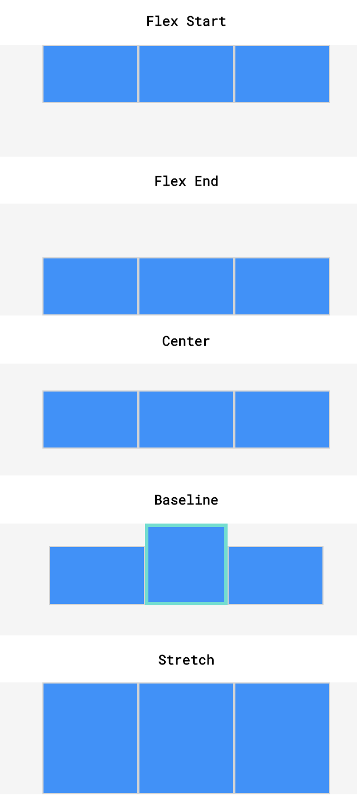

# Flexbox

- [flexboxfroggy.com - GAME](http://flexboxfroggy.com/#de)
- [A complete Guide to Flexbox - CSS-Tricks](https://css-tricks.com/snippets/css/a-guide-to-flexbox/)
- [CSS Flexbox - w3schools](https://www.w3schools.com/css/css3_flexbox.asp)
- [Flexbox - MDN](https://developer.mozilla.org/de/docs/Learn/CSS/CSS_layout/Flexbox)
- [flexbox.help](http://flexbox.help/)
- [Flexbox Generator](https://loading.io/flexbox/)
- [A visual Guide to Flexbox Properties](https://scotch.io/tutorials/a-visual-guide-to-css3-flexbox-properties)
- [Flexbox Playground](https://demos.scotch.io/visual-guide-to-css3-flexbox-flexbox-playground/demos/)
- [use-flexbox-to-create-a-sticky-header-and-sidebar-with-flexible-content](https://www.bitovi.com/blog/use-flexbox-to-create-a-sticky-header-and-sidebar-with-flexible-content)
- [Easiest Flex-Grid ever](https://www.taniarascia.com/easiest-flex-grid-ever/)
- [flexbox.io](https://www.flexbox.io/)

------

## Flexbox Basics

In flexbox, the outer box is called the **container**. The inner boxes (the columns) are called the **items**. Any element can be a flex container.

The **flex container** (parent) becomes flexible by setting the display property to flex: `display:flex` or `display:inline-flex`

```css
div.container {
  display: flex;
}
```

In the example above, all divs with the class container are flex containers. If they have children, the children are flex items.

- A div with the declaration `display: flex;` will remain block level — no other elements will appear on the same line
- But it will change the behavior of its child elements: Child elements will not begin on new lines.
- `display: inline-flex` creates flex containers that are also inline elements -> allows multiple flex containers to appear inline with each other.
- if the content doesn't fit, the parent will grow
- all elements have the same size, if they all have  `flex-grow:1`   
- Step 1: make Item as small as possible, Step 2: try to apply grow
- all flex items shrink proportionally when the flex container is too small.
- If a `max-width` is set for an element, it will not grow larger than that even if there is more space
- Flex containers can be nested inside of each other by declaring `display: flex` or `display: inline-flex` for children of flex containers.

## Flex Container properties :

### [`flex-direction`](https://www.w3schools.com/css/css3_flexbox_container.asp#flex-direction) 

- defines in which **direction** the container wants to stack the flex items (is used to specify the main and cross axes). By default, the **main axis** is horizontal (row) and the cross axis is vertical.
- Values: *row (default), row-reverse, column, column-reverse*
- The main axis is used for: `justify-content, flex-wrap, flex-grow, flex-shrink`. The cross axis is used for: `align-items, align-content`

### [`flex-wrap`](https://www.w3schools.com/css/css3_flexbox_container.asp#flex-wrap) 

- specifies whether the flex items should **wrap or not**. (shift along the cross axis if the flex container is not large enough)
- Values: *wrap, nowrap (default), wrap-reverse*

### [`flex-flow`](hhttps://www.w3schools.com/css/css3_flexbox_container.asp#flex-flow) 

- is a shorthand property for setting both the flex-direction and flex-wrap
- `flex-flow: direction wrap;`

### [`justify-content`](https://www.w3schools.com/css/css3_flexbox_container.asp#justify-content) 

- used to space items along the main axis - (horizontally from left to right). 
- The size of each item is not changed.
- Values: *center, flex-start (default), flex-end, space-around (equal space before+after items), space-between (equal space between, no extra space @start/end)*


### [`align-items`](https://www.w3schools.com/css/css3_flexbox_container.asp#align-items) 

- is used to space items along the cross axis (vertically). (within a single row)

- Values: *center, flex-start, flex-end, stretch (default), baseline (bottom aligned with each other)*

*\* stretch: elements with a specified height will not stretch; elements with a minimum height or no height specified will stretch).*



### [`align-content`](https://www.w3schools.com/css/css3_flexbox_container.asp#align-content) 

- If a flex container has multiple rows of content, we can use align-content to space the rows from top to bottom. 
- It is used to space rows along the cross axis.
- Values: *flex-start, flex-end, center, stretch, space-around (equal space), space-between (equal space except start/end)*

** stretch: if a minimum height or no height is specified*

------

## Flex Item properties:

The direct child elements of a flex container automatically becomes flexible (flex) items.

### [`order`](https://www.w3schools.com/css/css3_flexbox_items.asp#order) 

- specifies the order of the flex items. 
- The order value must be a number, default value is 0.

### [`flex-grow`](https://www.w3schools.com/css/css3_flexbox_items.asp#flex-grow) 

- specifies how much a flex item will grow relative to the rest of the flex items if there is space. 
- The value must be a number, default value is 0. 
- Margins are unaffected by flex-grow and flex-shrink.
  minimum and maximum widths will take precedence over flex-grow and flex-shrink

### [`flex-shrink`](https://www.w3schools.com/css/css3_flexbox_items.asp#flex-shrink) 

- specifies how much a flex item will shrink relative to the rest of the flex items. The value must be a number, default value is 1.
- flex-shrink will only be employed if the parent container is too small or the browser is adjusted

### [`flex-basis`](https://www.w3schools.com/css/css3_flexbox_items.asp#flex-basis) 

- specifies the initial length of a flex item before it stretches or shrinks.
- similar to `width`. if `flex-direction: column`: flex-basis=height
  - We can think of flex-basis as the width OR height (depending on flex-direction)
  - flex-basis is limited by both max-width/max-height and min-width/min-height
  - When declared, flex-basis will override the width/height property set on a flex container
  - If no flex-basis is specified the default is the set width/height value, if width/height isn’t specified the default is the width/height of the content
  - When there is not enough space for our flex items our items will shrink at an even rate to fit within the container by default
  - If there is too much space we can declare flex-grow: 1; on our flex items to make them grow at an even rate

### [`flex`](https://www.w3schools.com/css/css3_flexbox_items.asp#flex) 

- is a shorthand property for the flex-grow, flex-shrink, and flex-basis properties.
- `flex: grow shrink basis;`

### [`align-self`](https://www.w3schools.com/css/css3_flexbox_items.asp#align-self) 

- specifies the alignment for the selected item inside the flexible container.
-  It overrides the default alignment set by the container's align-items property. 

