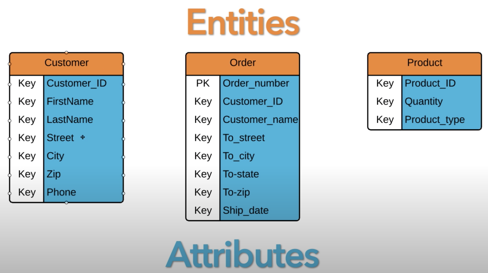
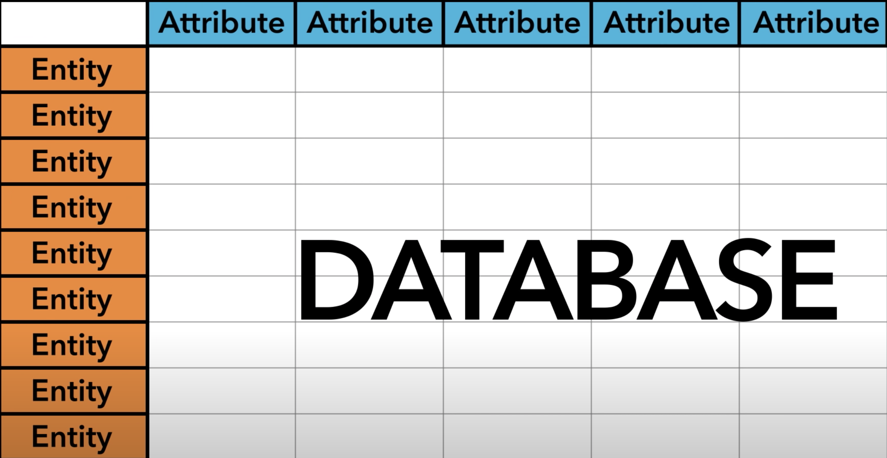
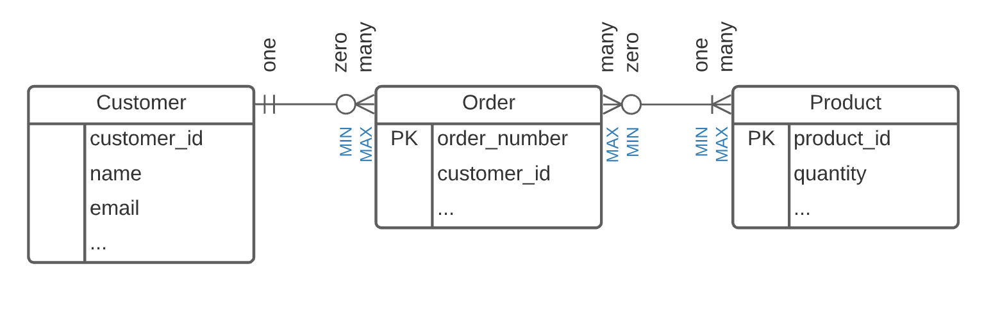
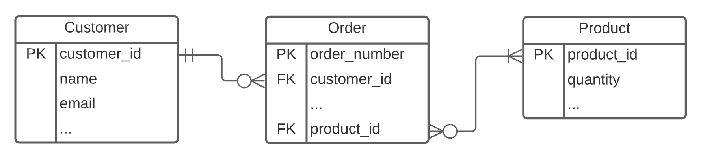
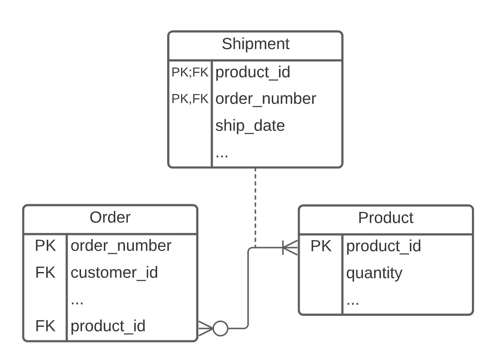
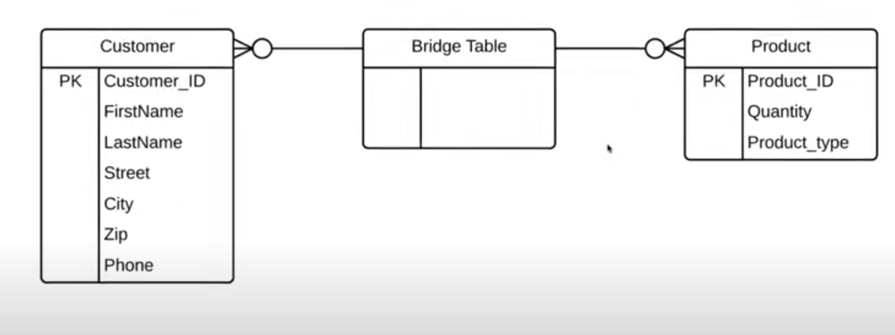

# Database Modelling

- Take your time to think about the tables that you will create. Pay close attention to the relationships between your tables.

- Use pen and paper or a whiteboard and draw some sketches first. 
- [Learn about Entity Relationship Diagrams (ERD)](https://www.youtube.com/watch?v=QpdhBUYk7Kk)

------

## ERD

Entity Relationship Diagrams

- Lucidchard

### Entities

- Entities - rows
- Attributes -columns

<!--  -->

<!--  -->

## Relationships

Describe, how the elements interact with each other

## Cardinality

::: tip

Think: what is the minimum and maximum:

:::

## Primary Key

Rules

1. unique 
2. never changing
3. never null

-  one PK per table

## Foreign Key

- Foreign Key dont have to be uniqe, they can be repeated
- There can be multiple Foreign Keys in one entity

### Composite Primary Key

when 2 or more attributes are used to uniquly identify a record

##### Rules:

1. Use the fewest amout of attributes possible

2. Don't use attributes that might change

   

## Bridge Table

<!--  -->

Breaks up the many-to-many relationship

