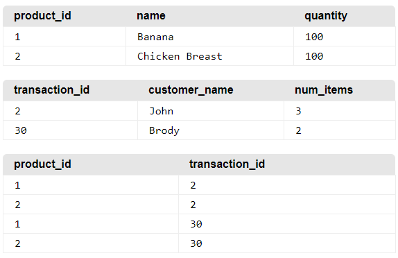

# Designing Relational Databases

[https://medium.com/@kimtnguyen/relational-database-schema-design-overview-70e447ff66f9](https://medium.com/@kimtnguyen/relational-database-schema-design-overview-70e447ff66f9)

What is essential to a good database design?

-  **Reduces redundancy**: Duplicate data wastes space and can lead to inconsistency.
-  **Provides access** with information a user needs to join tables together. (Use good primary keys, while creating proper relationships between tables.)
-  Ensures **data accuracy** and **integrity**.

## Design Process

[10 Best Database Design Practices](https://medium.com/quick-code/10-best-database-design-practices-1f10f3441730)

1. Define the purpose of the database

2. Figure out the Primary Key for each table

   -  A primary key can be multiple fields if necessary, in which this is known as a *composite key*, while a primary key using only one field is known as a *simple key*. 
   -  none of the columns can be NULL.

3. Determine the relationships among the tables 

   - There are many types of relationships between tables: one-to-one, one-to-many, many-to-many. 

   - **One-to-one:** In a one-to-one relationship, only one row of a table is linked to at most one row on the other table. 

   - One-to-Many: In a one-to-many relationship, one row of one table can link to many rows in a table. A great example of a one-to-many relationship is an AuthorsList and BooksList. 
     The advantage of a one-to-many relationship is to store the frequently used information in the parent table (the table with “one”), while referencing this information many times in the child table (the table with “many”)
     In the child table, there should be a **foreign key**, which is the parent table’s primary key, that is used to reference back to the parent table. 

   - **Many-to-Many**: In a many-to-many relationship, one or more rows of one table can link to 0, 1 or many rows in the other table. To implement this relationship, we must use a **mapping** or **intermediary** or **junction** table.

     

   

4. **Refine the Design —** Ask yourself these questions: do you have enough columns to represent your data? Could you derive a column from a combination of columns? Are you entering duplicate information? Do you have any empty fields in individual records? Can a large table be split into two? 

------

