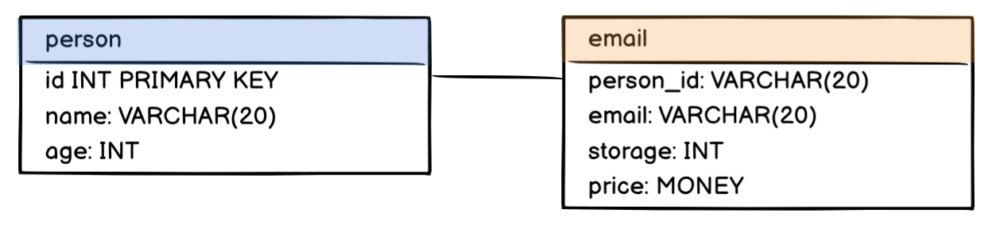
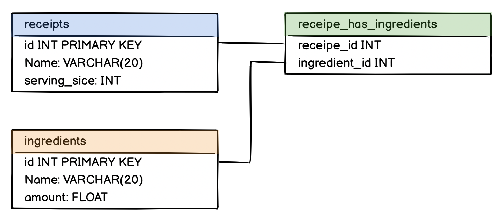

# SQL Relations

To refer from one table to the other. For Example:

A table “Teachers” and a table “Courses”. In the table “Courses” you have a column called “Teacher” where you want to refer to an entry in the table “Teachers”.


## Foreign keys

(point to other table)

https://www.w3schools.com/sql/sql_foreignkey.asp)

```sql
CREATE TABLE orders (
	id INT NOT NULL,
    oder_number INT,
    customer_id INT,
    product_id INT,
    PRIMARY KEY (id),
    FOREIGN KEY (customer_id) REFERENCES customers(id),
    FOREIGN KEY (product_id) REFERENCES products(id),
 )
```


[Tutorial on foreign keys - MariaDB](https://www.mariadbtutorial.com/mariadb-basics/mariadb-foreign-key/)

A foreign key refers to a column in a different table.

In our example, we have a table “Teachers” and a table “Courses”. In "courses", we have a column called “Teacher”, which refers to the “Teacher” table.

Use  SHOW CREATE TABLE  to see how it was created: `CONSTRAINT`

```
+---------+--------------------------------------
| Table   | Create Table
+---------+--------------------------------------
| Courses | CREATE TABLE `Courses` (
  `id` int(11) NOT NULL AUTO_INCREMENT,
  `name` varchar(20) DEFAULT NULL,
  `hours` int(11) DEFAULT NULL,
  `teacher` int(11) DEFAULT NULL,
  PRIMARY KEY (`id`),
	KEY `teacher` (`teacher`),
  CONSTRAINT `teacher` FOREIGN KEY (`teacher`) REFERENCES `Teachers` (`id`)
) ENGINE=InnoDB DEFAULT CHARSET=latin1 |
+---------+--------------------------------------
```

like this:

```
KEY <key_name> (<column_name>), 	# key_name: you can choose a name 
CONSTRAINT <constraint_name> 			# constraint_name: you can choose a name 
FOREIGN KEY (<column_name>) 			# specify column in the table 
REFERENCES <foreign_table>(<foreign_column>) 
# table and column) from the referenced table
```

------

## One-to-One Relationship

In a one-to-one relationship, a row of table A is associated with exactly one row of table B and vice-versa

-  example, a person may only have one passport assigned to them. Conversely, a passport may only be issued to one person. 

To enforce a strictly one-to-one relationship in PostgreSQL, we need another keyword, `UNIQUE`. By appending this keyword to the declaration of the foreign key, we should be all set.

```
license_id char(20) REFERENCES driver(license_id) UNIQUE
```


The full PostgreSQL script for creating these two tables is as follows:

```sql
CREATE TABLE driver (
    license_id char(20) PRIMARY KEY,
    name varchar(20),
    address varchar(100),
    date_of_birth date
);      
 
CREATE TABLE license (
    id integer PRIMARY KEY,
    state_issued varchar(20),
    date_issued date,
    date_expired  date,
    license_id char(20) REFERENCES driver(license_id) UNIQUE
); 
```

Select columns corresponding to `book` and `book_details` in the `SELECT` statement. Use the primary key of `book` and foreign key of `book_details` to write the `WHERE` clause of this query. For example:

```
SELECT table_one.column_one, table_two.column_two
FROM table_one, table_two
WHERE table_one.primary_key = table_two.foreign_key
```

An alternative is to use an inner `JOIN` query.

```
SELECT table_one.column_one, table_two.column_two
FROM table_one
JOIN table_two
ON table_one.primary_key = table_two.foreign_key
```


------

## One-to-Many Relationships

For example, consider a table where we want one person to be able to have many email addresses. 

- we need to represent a one-to-many relationship with two tables - a parent and a child table. 
- a parent table will house a primary key and the child table will house both primary and foreign keys. 
- The foreign key binds the child table to the parent table.



To write an `INNER JOIN` query of three tables, use the following syntax:

```sql
SELECT table_one.column_one AS alias_one, table_two.column_two AS alias_two, table_three.column_three AS alias_three
FROM table_one
INNER JOIN table_two
ON table_one.primary_key = table_two.foreign_key
INNER JOIN table_three
ON table_two.primary_key = table_three.foreign_key;
```

A teacher can teach multiple courses, but a course can only have one teacher.

-  you do this by **creating a foreign key in the table of the entity of the “one” side**. 
- put the reference in the table that can only have one reference to the other
- In our example, that’s the Courses table, because a course can only have one teacher

> ⚠ **Important:** Always put the foreign key into the table of the “one” side of the one-to-many relationship. It does not work on the “many” side.

------

## Many-to-Many Relationships

examples of many to many relationships:

- A student can take many courses while a course can have enrollments from many students.
- A recipe can have many ingredients while an ingredient can belong to many different recipes.
- A customer can patronize many banks while a bank can service many different customers.

a many-to-many relationship can be broken into two one-to-many relationships

To implement a many-to-many relationship in a relational database, we would create a third cross-reference table also known as a join table.

It will have these two constraints:

- foreign keys referencing the primary keys of the two member tables.
- a composite primary key made up of the two foreign keys.



Both `recipe_id` and `ingredient_id` also serve as a composite primary key for `recipes_ingredients`.

> 
>
> To display selected columns (`column_one` and `column_two`) from different tables (`table_one` and `table_two`) as aliases (`alias_one` and `alias_two`) and join them with the help of a cross-reference table (`joined_table`), use the following syntax:
>
> ```sql
> SELECT column_one AS alias_one, column_two AS alias_two
> FROM table_one, table_two, joined_table
> WHERE table_one.primary_key = joined_table.foreign_key_one
> AND table_two.primary_key = joined_table.foreign_key_two
> ```
>
> Alternatively, you can query with `INNER JOIN` from three tables.
>
> ```sql
> SELECT column_one AS alias_one, column_two AS alias_two
> FROM table_one
> INNER JOIN joined_table
> ON table_one.primary_key = joined_table.foreign_key_one
> INNER JOIN table_two
> ON table_two.primary_key = joined_table.foreign_key_two
> ```
>


[https://web.csulb.edu/colleges/coe/cecs/dbdesign/dbdesign.php?page=manymany.php](https://web.csulb.edu/colleges/coe/cecs/dbdesign/dbdesign.php?page=manymany.php)

- We can’t represent a many-to-many association directly in a relation scheme, because two tables can’t be children of each other.
- for *every* many-to-many association, we will need an additional table, known as a **junction table** (sometimes also called a join table or linking table)
  - will contain two sets of FK attributes, one for each side of the association
- The **PK of this junction table is both FKs combined**. 

------

For example, if you have a table “Courses” and a table “Students”, you want to connect these two tables in some way that a student can take many courses, and a course can have many students.

This is done by creating a third table that represents the relationship.


------

​	
