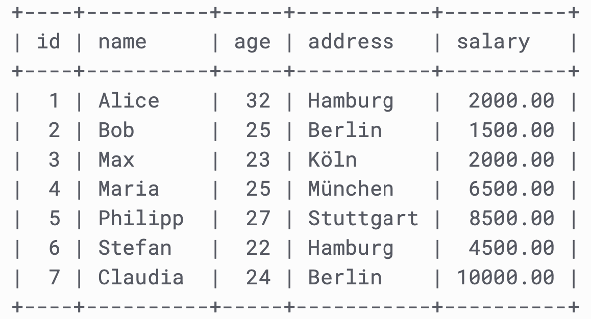
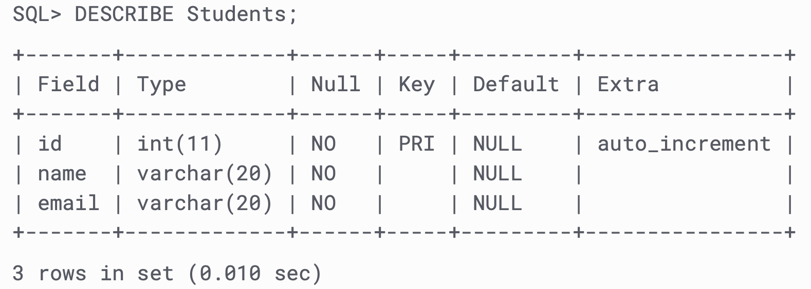

# SQL Tables

## Tables

In relational databases, data is organized in tables. This example shows a table called “Customers”:

> convention: table names sould be plural




In such a table, a column is an **attribute**, and a row is a **dataentry**.

Look at a selection from the Northwind "Customers" table:

| CustomerID | CustomerName                       | ContactName        | Address                       | City        | PostalCode | Country |
| :--------- | :--------------------------------- | :----------------- | :---------------------------- | :---------- | :--------- | :------ |
| 1          | Alfreds Futterkiste                | Maria Anders       | Obere Str. 57                 | Berlin      | 12209      | Germany |
| 2          | Ana Trujillo Emparedados y helados | Ana Trujillo       | Avda. de la Constitución 2222 | México D.F. | 05021      | Mexico  |
| 3          | Antonio Moreno Taquería            | Antonio Moreno     | Mataderos 2312                | México D.F. | 05023      | Mexico  |
| 4          | Around the Horn                    | Thomas Hardy       | 120 Hanover Sq.               | London      | WA1 1DP    | UK      |
| 5          | Berglunds snabbköp                 | Christina Berglund | Berguvsvägen 8                | Luleå       | S-958 22   | Sweden  |

The columns in the "Customers" table above are: CustomerID, CustomerName, ContactName, Address, City, PostalCode and Country. The table has 5 records (rows).

------

### Create a Table

> convention: table-name is plural (lowercase, snake_case)

```sql
CREATE TABLE Customers( 
	id			INT						NOT NULL,
	name		VARCHAR(20)		NOT NULL,
	age 		INT						NOT NULL,
	address TEXT,
	salary	DECIMAL (18, 2),
	PRIMARY KEY (id)
);
```

In general, the syntax is like this:

```
CREATE TABLE table_name(
   column1 datatype,
   column2 datatype,
   column3 datatype,
   .....
   columnN datatype,
   PRIMARY KEY( one or more columns )
);
```

#### other example:

```sql
CREATE TABLE products (
	  id INT NOT NULL,
  	name STRING,
  	price MONEY,
  	PRIMARY KEY (id)
)
```


------

### Data Types


For each column, you need to define the data type. Common data types are:

```
INT			- length 11 means 11 bytes
FLOAT
DECIMAL - DECIMAL(#digits, #digits after floating point)
BOOLEAN
VARCHAR	- VARCHAR(length)
TEXT    - any length
ENUM
DATE		- formatted as YYYY-MM-DD
BLOB		- BINARY LARGE OBJECT. eg. (for images, but it's better to store a file-reference)
```

> There is no boolean data type

[https://www.w3schools.com/sql/sql_datatypes.asp](https://www.w3schools.com/sql/sql_datatypes.asp)

[https://mariadb.com/kb/en/library/data-types/](https://mariadb.com/kb/en/library/data-types/)

------

### Data Type Specifications

Some data types you can specify even further:

| Specification  |                                                    |
| -------------- | -------------------------------------------------- |
| UNSIGNED       | only positive numbers                              |
| SIGNED         | can have a sign (positive or negative)             |
| NOT NULL       | required - can not be null                         |
| AUTO_INCREMENT | if not set, increment automatically (used for IDs) |

------

### Primary Key

always needed - Primary keys must contain UNIQUE values, and cannot contain NULL values.

[SQL primary key](https://www.w3schools.com/sql/sql_primarykey.asp)

-› assign a column

Every table needs one unique ID-field.  This field (or column) is called the **primary key**.

You usually use integers for it. They need to be **NOT NULL**.

> It is fine if IDs have "holes" - the just have to be unique

```
CREATE TABLE Customers( 
	id			INT						NOT NULL,
	name		VARCHAR(20)		NOT NULL,
	age 		INT						NOT NULL,
	address TEXT,
	salary	DECIMAL (18, 2),
	PRIMARY KEY (id)
);
```

It is recommended to set this column to **AUTO_INCREMENT**. This means that if you don’t specify it for a new row, the database automatically sets it to a value that is the last value +1.

```
CREATE TABLE Customers(
	id INT NOT NULL AUTO_INCREMENT, 
	...
	PRIMARY KEY (ID)
);
```

------

### Show All Tables

Show all tables in a database:

```
SHOW TABLES;
```

------

### Show Columns of a Table

```
DESCRIBE Students;
```



------

