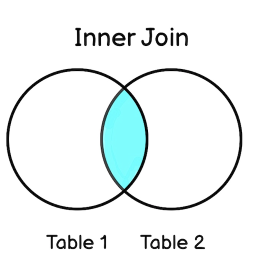

# SQL Commands Reference

- SQL keywords are NOT case sensitive: `select` is the same as `SELECT`
- Semicolon is the standard way to separate each SQL statement in database systems that allow more than one SQL statement to be executed in the same call to the server.

## Some of The Most Important SQL Commands

- `SELECT` - extracts data from a database
- `UPDATE` - updates data in a database
- `DELETE` - deletes data from a database
- `INSERT INTO` - inserts new data into a database
- `CREATE DATABASE` - creates a new database
- `ALTER DATABASE` - modifies a database
- `CREATE TABLE` - creates a new table
- `ALTER TABLE` - modifies a table
- `DROP TABLE` - deletes a table
- `CREATE INDEX` - creates an index (search key)
- `DROP INDEX` - deletes an index

------

## SQL SELECT

The `SELECT` statement is used to select data from a database.

The data returned is stored in a result table, called the result-set.

#### SELECT Syntax

```sql
SELECT *column1*, *column2, ...*
FROM *table_name*;
```

Select all:

```sql
SELECT * FROM table_name;
```

### SQL SELECT DISTINCT

 is used to return only distinct (different) values

```sql
SELECT DISTINCT Country FROM Customers;
```

Count and return the number of different (distinct) countries in the "Customers" table:

```sql
SELECT COUNT(DISTINCT Country) FROM Customers;
```

> COUNT(DISTINCT *column_name*) is not supported in Microsoft Access databases

------

## SQL WHERE Clause

 to filter records -› only those records that fulfill a specified condition

```sql
SELECT column1, column2, ...
FROM table_name
WHERE condition;
```

> The `WHERE` clause is not only used in `SELECT` statements, it is also used in `UPDATE`, `DELETE`, etc.!

```sql
SELECT * FROM Customers
WHERE Country='Germany';
```

### Text Fields vs. Numeric Fields

SQL requires single quotes around text values (most database systems will also allow double quotes).

However, numeric fields should not be enclosed in quotes:

------

## Operators in The WHERE Clause

The following operators can be used in the `WHERE` clause:

| Operator | Description                                                  |
| :------- | :----------------------------------------------------------- |
| =        | Equal                                                        |
| >        | Greater than                                                 |
| <        | Less than                                                    |
| >=       | Greater than or equal                                        |
| <=       | Less than or equal                                           |
| <>       | Not equal. **Note:** In some versions of SQL this operator may be written as != |
| BETWEEN  | Between a certain range                                      |
| LIKE     | Search for a pattern                                         |
| IN       | To specify multiple possible values for a column             |

```
SELECT * FROM Products
WHERE Price BETWEEN 50 AND 60;
```

```
SELECT * FROM Customers
WHERE City LIKE 's%';
```

```
SELECT * FROM Customers
WHERE City IN ('Paris','London','Berlin');
```

------

### SQL AND, OR and NOT Operators

`WHERE`  can be combined with `AND`, `OR`, and `NOT` operators.

#### AND Syntax

```
SELECT *column1*, *column2, ...*
FROM *table_name*
WHERE *condition1* AND *condition2* AND *condition3 ...*;
```

#### OR Syntax

```
SELECT *column1*, *column2, ...*
FROM *table_name*
WHERE *condition1* OR *condition2* OR *condition3 ...*;
```


```
SELECT * FROM Customers
WHERE City='Berlin' OR City='München';
```

```
SELECT * FROM Customers
WHERE Country='Germany' OR Country='Spain';
```

#### NOT Syntax

```
SELECT *column1*, *column2, ...*
FROM *table_name*
WHERE NOT *condition*;
```

```sql
SELECT * FROM Customers
WHERE NOT Country='Germany';
```

#### Combining AND, OR and NOT

```sql
SELECT * FROM Customers
WHERE Country='Germany' AND (City='Berlin' OR City='München');	
```

```sql
SELECT * FROM Customers
WHERE NOT Country='Germany' AND NOT Country='USA';		
```

------

## SQL ORDER BY Keyword

Sort the result-set in ascending or descending order.

```sql
SELECT * FROM Customers
ORDER BY Country;		
```

```sql
SELECT * FROM Customers
ORDER BY Country DESC;
```

several columns:

orders by Country, but if some rows have the same Country, it orders them by CustomerName:

```sql
SELECT * FROM Customers
ORDER BY Country, CustomerName;
```

sorted ascending by the "Country" and descending by the "CustomerName" column:

```sql
SELECT * FROM Customers
ORDER BY Country ASC, CustomerName DESC;
```

------

## SQL INSERT INTO

to insert new records in a table

```sql
INSERT INTO table_name (column1, column2, column3, ...)
VALUES (value1, value2, value3, ...);		
```

or ( make sure the order of the values is in the same order as the columns in the table.):

```sql
INSERT INTO table_name
VALUES (value1, value2, value3, ...);
```

```sql
INSERT INTO Customers (CustomerName, ContactName, Address, City, PostalCode, Country)
VALUES ('Cardinal', 'Tom B. Erichsen', 'Skagen 21', 'Stavanger', '4006', 'Norway');
```

> The CustomerID column is an [auto-increment](https://www.w3schools.com/sql/sql_autoincrement.asp) field and will be generated automatically when a new record is inserted into the table.

### Insert Data Only in Specified Columns

```sql
INSERT INTO Customers (CustomerName, City, Country)
VALUES ('Cardinal', 'Stavanger', 'Norway');
```

------

## SQL NULL Values

 A field with a NULL value is one that has been left blank during record creation!

### How to Test for NULL Values?

use the `IS NULL` and `IS NOT NULL` operators

```sql
SELECT column_names
FROM table_name
WHERE column_name IS NULL;
```

```sql
SELECT column_names
FROM table_name
WHERE column_name IS NOT NULL;
```

examples:

```sql
SELECT CustomerName, ContactName, Address
FROM Customers
WHERE Address IS NULL;
```

```sql
SELECT CustomerName, ContactName, Address
FROM Customers
WHERE Address IS NOT NULL;
```

------

## SQL UPDATE

```sql
UPDATE *table_name*
SET *column1* = *value1*, *column2* = *value2*, ...
WHERE *condition*;
```

> be carefull!!  alway use where - otherwise all records will be updated

```sql
UPDATE Customers
SET ContactName = 'Alfred Schmidt', City= 'Frankfurt'
WHERE CustomerID = 1;
```

### UPDATE Multiple Records

```sql
UPDATE Customers
SET ContactName='Juan'
WHERE Country='Mexico';
```

------

## SQL DELETE

```sql
DELETE FROM table_name WHERE condition;
```

```sql
DELETE FROM Customers WHERE CustomerName='Alfreds Futterkiste';
```

### Delete All Records

>  Be careful when deleting records in a table! If you omit the `WHERE` clause, all records in the table will be deleted!

```sql
DELETE FROM Customers;
```

------

## SQL SELECT TOP / LIMIT

MySQL Syntax:

```sql
SELECT column_name(s)
FROM table_name
WHERE condition
LIMIT number;
```

> Not all database systems support `LIMIT`. SQL Server / MS Access support the ``SELECT TOP ` clause to select a limited number of records, while Oracle uses `FETCH FIRST *n* ROWS ONLY` and `ROWNUM`.

```sql
SELECT * FROM Customers
LIMIT 3;
```

```sql
SELECT * FROM Customers
WHERE Country='Germany'
LIMIT 3;
```

------

## SQL MIN() and MAX()

The `MIN()` function returns the smallest value of the selected column.

```
SELECT MIN(column_name)
FROM table_name
WHERE condition;
```

```sql
SELECT MIN(Price) AS SmallestPrice
FROM Products;
```


The `MAX()` function returns the largest value of the selected column.

```
SELECT MAX(column_name)
FROM table_name
WHERE condition;
```

```sql
SELECT MAX(Price) AS LargestPrice
FROM Products;
```

------

## SQL COUNT(), AVG() and SUM()

### `COUNT()` 

returns the number of rows that matches a specified criterion

```
SELECT COUNT(column_name)
FROM table_name
WHERE condition;
```

```sql
SELECT COUNT(ProductID)
FROM Products;
```

### `AVG()`  

returns the average value of a numeric column. 

```
SELECT AVG(column_name)
FROM table_name
WHERE condition;
```

```sql
SELECT AVG(Price)
FROM Products;
```

###  `SUM()`  

returns the total sum of a numeric column. 

```
SELECT SUM(column_name)
FROM table_name
WHERE condition;
```

```sql
SELECT SUM(Quantity)
FROM OrderDetails;
```

> **Note:** NULL values are ignored.

------

## SQL LIKE 

Is used in a `WHERE` clause to search for a specified pattern

**wildcards** often used in conjunction with the `LIKE` operator:

-  The percent sign (%) represents zero, one, or multiple characters
-  The underscore sign (_) represents one, single character

> MS Access uses an asterisk (*) instead of the percent sign (%), and a question mark (?) instead of the underscore (_).

```
SELECT column1, column2, ...
FROM table_name
WHERE columnN LIKE pattern;
```

You can also combine any number of conditions using `AND` or `OR` operators.

| LIKE Operator                       | Description                                                  |
| :---------------------------------- | :----------------------------------------------------------- |
| `WHERE CustomerName LIKE 'a%'`      | Finds any values that start with "a"                         |
| `WHERE CustomerName LIKE '%a'`      | Finds any values that end with "a"                           |
| `WHERE CustomerName LIKE '%or%'`    | Finds any values that have "or" in any position              |
| `WHERE CustomerName LIKE '_r%'`     | Finds any values that have "r" in the second position        |
| `WHERE CustomerName LIKE 'a_%'`     | Finds any values that start with "a" and are at least 2 characters in length |
| `WHERE CustomerName LIKE 'a__%'`    | Finds any values that start with "a" and are at least 3 characters in length |
| `WHERE ContactName LIKE 'a%o'`      | Finds any values that start with "a" and ends with "o"       |
| `WHERE CustomerName NOT LIKE 'a%';` | Finds any values that  that do NOT start with "a"            |

### Examples

```sql
SELECT * FROM Customers
WHERE City LIKE 'ber%';
```

```sql
SELECT * FROM Customers
WHERE City LIKE '%es%';
```

```sql
SELECT * FROM Customers
WHERE City LIKE '_ondon';
```

```sql
SELECT * FROM Customers
WHERE City LIKE 'L_n_on';
```

------

> MS Access offers more Wildcatds than MySQL

------

## SQL IN

A shorthand for multiple `OR` conditions - allows you to specify multiple values in a `WHERE` clause.

```
SELECT column_name(s)
FROM table_name
WHERE column_name IN (value1, value2, ...);
```

or

```
SELECT column_name(s)
FROM table_name
WHERE column_name IN (SELECT STATEMENT);
```

```sql
SELECT * FROM Customers
WHERE Country IN ('Germany', 'France', 'UK');
```

```sql
SELECT * FROM Customers
WHERE Country NOT IN ('Germany', 'France', 'UK');
```

selects all customers that are from the same countries as the suppliers:

```sql
SELECT * FROM Customers
WHERE Country IN (SELECT Country FROM Suppliers);
```

------

## SQL BETWEEN

 selects values within a given range.

- values can be numbers, text, or dates
- is inclusive: begin and end values are included

```
SELECT column_name(s)
FROM table_name
WHERE column_name BETWEEN value1 AND value2;
```

```sql
SELECT * FROM Products
WHERE Price BETWEEN 10 AND 20;
```

```sql
SELECT * FROM Products
WHERE Price NOT BETWEEN 10 AND 20;
```

```sql
SELECT * FROM Products
WHERE Price BETWEEN 10 AND 20
AND CategoryID NOT IN (1,2,3);
```

```sql
SELECT * FROM Products
WHERE ProductName BETWEEN 'C%' AND 'N%'
ORDER BY ProductName;
```

```sql
SELECT * FROM Products
WHERE ProductName NOT BETWEEN 'Carnarvon Tigers' AND 'Mozzarella di Giovanni'
ORDER BY ProductName;
```

```sql
SELECT * FROM Orders
WHERE OrderDate BETWEEN #07/01/1996# AND #07/31/1996#;
```

```sql
SELECT * FROM Orders
WHERE OrderDate BETWEEN '1996-07-01' AND '1996-07-31';
```

------

## SQL Aliases

To give a table, or a column in a table, a temporary name.

- often used to make column names more readable.
- only exists for the duration of that query.
- created with the `AS` keyword.

#### Column Syntax

```sql
SELECT column_name AS alias_name
FROM table_name;
```

#### Table Syntax

```sql
SELECT column_name(s)
FROM table_name AS alias_name;
```


```sql
SELECT CustomerID AS ID, CustomerName AS Customer
FROM Customers;
```

> **Note:** It requires double quotation marks or square brackets if the alias name contains spaces:
>
> ```sql
> SELECT CustomerName AS Customer, ContactName AS [Contact Person]
> FROM Customers;
> ```
>
> or
>
> ```sql
> SELECT CustomerName AS Customer, ContactName AS 'Contact Person'
> FROM Customers;	
> ```
>
> or
>
> ```sql
> SELECT CustomerName AS Customer, ContactName AS "Contact Person"
> FROM Customers;
> ```

### CONCAT (MySQL)

This creates an alias named "Address" that combines four columns (Address, PostalCode, City and Country):

```sql
SELECT CustomerName, CONCAT(Address,', ',PostalCode,', ',City,', ',Country) AS Address
FROM Customers;
```

> other DBs:
>
> ```sql
> SELECT CustomerName, Address + ', ' + PostalCode + ' ' + City + ', ' + Country AS Address
> FROM Customers;
> ```

result:

| CustomerName                       | Address                                                  |
| :--------------------------------- | :------------------------------------------------------- |
| Alfreds Futterkiste                | Obere Str. 57, 12209 Berlin, Germany                     |
| Ana Trujillo Emparedados y helados | Avda. de la Constitución 2222, 05021 México D.F., Mexico |
| Antonio Moreno Taquería            | Mataderos 2312, 05023 México D.F., Mexico                |
| ...                                |                                                          |

### CONCAT_WS (MySQL)

adds a seperator (eg ", ")

```sql
SELECT CustomerName, CONCAT_WS(', ', Address, PostalCode, City, Country) AS Address
FROM Customers;
```

### Alias for Tables Example

```sql
SELECT o.OrderID, o.OrderDate, c.CustomerName
FROM Customers AS c, Orders AS o
WHERE c.CustomerName='Around the Horn' AND c.CustomerID=o.CustomerID;
```

We use the "Customers" and "Orders" tables, and give them the table aliases of "c" and "o" respectively (Here we use aliases to make the SQL shorter)

This is the same as above, but without aliases:

```sql
SELECT Orders.OrderID, Orders.OrderDate, Customers.CustomerName
FROM Customers, Orders
WHERE Customers.CustomerName='Around the Horn' AND Customers.CustomerID=Orders.CustomerID;
```

Aliases can be useful when:

- There are more than one table involved in a query
- Functions are used in the query
- Column names are big or not very readable
- Two or more columns are combined together

------

## SQL Joins

is used to combine rows from two or more tables, based on a related column between them.

- `(INNER) JOIN`: Returns records that have matching values in both tables

- `LEFT (OUTER) JOIN`: Returns all records from the left table, and the matched records from the right table

- `RIGHT (OUTER) JOIN`: Returns all records from the right table, and the matched records from the left table

- `FULL (OUTER) JOIN`: Returns all records when there is a match in either left or right table

### SQL INNER JOIN

Selects records that have matching values in both tables.

```
SELECT column_name(s)
FROM table1
INNER JOIN table2
ON table1.column_name = table2.column_name;
```



```sql
SELECT Orders.OrderID, Customers.CustomerName, Orders.OrderDate
FROM Orders
INNER JOIN Customers ON Orders.CustomerID=Customers.CustomerID;
```

> **Note:** The `INNER JOIN` keyword selects all rows from both tables as long as there is a match between the columns. If there are records in the "Orders" table that do not have matches in "Customers", these orders will not be shown!


#### JOIN Three Tables

```sql
SELECT Orders.OrderID, Customers.CustomerName, Shippers.ShipperName
FROM ((Orders
INNER JOIN Customers ON Orders.CustomerID = Customers.CustomerID)
INNER JOIN Shippers ON Orders.ShipperID = Shippers.ShipperID);
```

```
SELECT Orders.OrderID, Customers.CustomerName, Shippers.ShipperName
FROM (
	(
		Orders INNER JOIN Customers ON Orders.CustomerID = Customers.CustomerID
	)
	INNER JOIN Shippers ON Orders.ShipperID = Shippers.ShipperID
);
```

------

### SQL LEFT JOIN

returns all records from the left table (table1), and the matching records from the right table (table2).

```
SELECT column_name(s)
FROM table1
LEFT JOIN table2
ON table1.column_name = table2.column_name;
```

> **Note:** In some databases LEFT JOIN is called LEFT OUTER JOIN.


This will select all customers, and any orders they might have:

```sql
SELECT Customers.CustomerName, Orders.OrderID
FROM Customers
LEFT JOIN Orders ON Customers.CustomerID = Orders.CustomerID
ORDER BY Customers.CustomerName;
```

> **Note:** The `LEFT JOIN` keyword returns all records from the left table (Customers), even if there are no matches in the right table (Orders).

------

### SQL RIGHT JOIN

returns all records from the right table (table2), and the matching records from the left table (table1). 

```
SELECT column_name(s)
FROM table1
RIGHT JOIN table2
ON table1.column_name = table2.column_name;
```

> **Note:** In some databases `RIGHT JOIN` is called `RIGHT OUTER JOIN`.


```sql
SELECT Orders.OrderID, Employees.LastName, Employees.FirstName
FROM Orders
RIGHT JOIN Employees ON Orders.EmployeeID = Employees.EmployeeID
ORDER BY Orders.OrderID;
```

------

### SQL CROSS JOIN (MySQL)

Returns all records from both tables (table1 and table2).


```
SELECT column_name(s)
FROM table1
CROSS JOIN table2;
```

> **Note:** `CROSS JOIN` can potentially return very large result-sets!

```sql
SELECT Customers.CustomerName, Orders.OrderID
FROM Customers
CROSS JOIN Orders;
```

> If you add a `WHERE` clause (if table1 and table2 has a relationship), the `CROSS JOIN` will produce the same result as the `INNER JOIN` clause:

```sql
SELECT Customers.CustomerName, Orders.OrderID
FROM Customers
CROSS JOIN Orders
WHERE Customers.CustomerID=Orders.CustomerID;
```

------

### SQL Self Join

the table is joined with itself.

```
SELECT column_name(s)
FROM table1 T1, table1 T2
WHERE condition;
```

*T1* and *T2* are different table aliases for the same table.

```sql
SELECT A.CustomerName AS CustomerName1, B.CustomerName AS CustomerName2, A.City
FROM Customers A, Customers B
WHERE A.CustomerID <> B.CustomerID
AND A.City = B.City
ORDER BY A.City;
```

------

## SQL UNION Operator

To combine the result-set of two or more `SELECT` statements.

- Every `SELECT` statement within `UNION` must have the same number of columns
- The columns must also have similar data types
- The columns in every `SELECT` statement must also be in the same order

```
SELECT column_name(s) FROM table1
UNION
SELECT column_name(s) FROM table2;
```

To allow duplicate values, use `UNION ALL`:

```
SELECT column_name(s) FROM table1
UNION ALL
SELECT column_name(s) FROM table2;
```

```sql
SELECT City FROM Customers
UNION
SELECT City FROM Suppliers
ORDER BY City;
```

>  If some customers or suppliers have the same city, each city will only be listed once, because `UNION` selects only distinct values.

```sql
SELECT City FROM Customers
UNION ALL
SELECT City FROM Suppliers
ORDER BY City;
```


with WHERE:

```sql
SELECT City, Country FROM Customers
WHERE Country='Germany'
UNION
SELECT City, Country FROM Suppliers
WHERE Country='Germany'
ORDER BY City;
```

------

```sql
SELECT 'Customer' AS Type, ContactName, City, Country
FROM Customers
UNION
SELECT 'Supplier', ContactName, City, Country
FROM Suppliers
```

> Notice the "AS Type" above - it is an alias. [SQL Aliases](https://www.w3schools.com/sql/sql_alias.asp) are used to give a table or a column a temporary name. An alias only exists for the duration of the query. So, here we have created a temporary column named "Type", that list whether the contact person is a "Customer" or a "Supplier".

------

## SQL GROUP BY

groups rows that have the same values into summary rows, like "find the number of customers in each country".

often used with aggregate functions (`COUNT()`, `MAX()`, `MIN()`, `SUM()`, `AVG()`) to group the result-set by one or more columns.

```
SELECT column_name(s)
FROM table_name
WHERE condition
GROUP BY column_name(s)
ORDER BY column_name(s);
```

number of customers in each country:

```sql
SELECT COUNT(CustomerID), Country
FROM Customers
GROUP BY Country;
```

 number of customers in each country, sorted high to low:

```sql
SELECT COUNT(CustomerID), Country
FROM Customers
GROUP BY Country
ORDER BY COUNT(CustomerID) DESC;
```

### GROUP BY With JOIN

```sql
SELECT Shippers.ShipperName, COUNT(Orders.OrderID) AS NumberOfOrders FROM Orders
LEFT JOIN Shippers ON Orders.ShipperID = Shippers.ShipperID
GROUP BY ShipperName;
```

------

## SQL HAVING

was added to SQL because the `WHERE` keyword cannot be used with aggregate functions.

```
SELECT column_name(s)
FROM table_name
WHERE condition
GROUP BY column_name(s)
HAVING condition
ORDER BY column_name(s);
```

lists the number of customers in each country. Only include countries with more than 5 customers:

```sql
SELECT COUNT(CustomerID), Country
FROM Customers
GROUP BY Country
HAVING COUNT(CustomerID) > 5;
```

 lists the employees that have registered more than 10 orders:

```sql
SELECT Employees.LastName, COUNT(Orders.OrderID) AS NumberOfOrders
FROM (Orders
INNER JOIN Employees ON Orders.EmployeeID = Employees.EmployeeID)
GROUP BY LastName
HAVING COUNT(Orders.OrderID) > 10;
```

lists if the employees "Davolio" or "Fuller" have registered more than 25 orders:

```sql
SELECT Employees.LastName, COUNT(Orders.OrderID) AS NumberOfOrders
FROM Orders
INNER JOIN Employees ON Orders.EmployeeID = Employees.EmployeeID
WHERE LastName = 'Davolio' OR LastName = 'Fuller'
GROUP BY LastName
HAVING COUNT(Orders.OrderID) > 25;
```

------

## SQL EXISTS

to test for the existence of any record in a subquery

-› returns TRUE if the subquery returns one or more record

```
SELECT column_name(s)
FROM table_name
WHERE EXISTS
(SELECT column_name FROM table_name WHERE condition);
```

```sql
SELECT SupplierName
FROM Suppliers
WHERE EXISTS (SELECT ProductName FROM Products WHERE Products.SupplierID = Suppliers.supplierID AND Price < 20);
```

 returns TRUE and lists the suppliers with a product price less than 20

```sql
SELECT SupplierName
FROM Suppliers
WHERE EXISTS (SELECT ProductName FROM Products WHERE Products.SupplierID = Suppliers.supplierID AND Price = 22);
```

------

## SQL ANY and ALL

 allow you to perform a comparison between a single column value and a range of other values

### SQL ANY

- returns a boolean value as a result
- returns TRUE if ANY of the subquery values meet the condition

 condition will be true if the operation is true for any of the values in the range.

```
SELECT column_name(s)
FROM table_name
WHERE column_name operator ANY
  (SELECT column_name
  FROM table_name
  WHERE condition);
```

> **Note:** The *operator* must be a standard comparison operator (=, <>, !=, >, >=, <, or <=)

#### Examples

lists the ProductName if it finds ANY records in the OrderDetails table has Quantity equal to 10 (this will return TRUE because the Quantity column has some values of 10):

```sql
SELECT ProductName 
FROM Products
WHERE ProductID = ANY (SELECT ProductID FROM OrderDetails WHERE Quantity = 10);
```

lists the ProductName if it finds ANY records in the OrderDetails table has Quantity larger than 99 

```sql
SELECT ProductName
FROM Products
WHERE ProductID = ANY
  (SELECT ProductID
  FROM OrderDetails
  WHERE Quantity > 99);
```


### SQL ALL

- returns a boolean value as a result
- returns TRUE if ALL of the subquery values meet the condition
- is used with `SELECT`, `WHERE` and `HAVING` statements

will be true only if the operation is true for all values in the range. 

```
SELECT ALL column_name(s)
FROM table_name
WHERE condition;
```

##### Syntax With WHERE or HAVING

```sql
SELECT column_name(s)
FROM table_name
WHERE column_name operator ALL
  (SELECT column_name
  FROM table_name
  WHERE condition);
```

#### Examples

```sql
SELECT ALL ProductName
FROM Products
WHERE TRUE;
```

```sql
SELECT ProductName
FROM Products
WHERE ProductID = ALL
  (SELECT ProductID
  FROM OrderDetails
  WHERE Quantity = 10);
```

------

## MySQL INSERT INTO SELECT

> check [SELECT INTO](https://www.w3schools.com/sql/sql_select_into.asp) for other DBs

copies data from one table and inserts it into another table.

requires that the data types in source and target tables matches

Copy all columns

```sql
INSERT INTO table2
SELECT * FROM table1
WHERE condition;
```

Copy only some columns 

```sql
INSERT INTO table2 (column1, column2, column3, ...)
SELECT column1, column2, column3, ...
FROM table1
WHERE condition;
```

copy "Suppliers" into "Customers" (the columns that are not filled with data, will contain NULL):

```sql
INSERT INTO Customers (CustomerName, City, Country)
SELECT SupplierName, City, Country FROM Suppliers;
```


copies only the German suppliers into "Customers":

```sql
INSERT INTO Customers (CustomerName, City, Country)
SELECT SupplierName, City, Country FROM Suppliers
WHERE Country='Germany';
```

------

## SQL CASE

goes through conditions and returns a value when the first condition is met (like an if-then-else statement). So, once a condition is true, it will stop reading and return the result. If no conditions are true, it returns the value in the `ELSE` clause.

If there is no `ELSE` part and no conditions are true, it returns NULL.

```
CASE
    WHEN condition1 THEN result1
    WHEN condition2 THEN result2
    WHEN conditionN THEN resultN
    ELSE result
END;
```


```sql
SELECT OrderID, Quantity,
CASE
    WHEN Quantity > 30 THEN 'The quantity is greater than 30'
    WHEN Quantity = 30 THEN 'The quantity is 30'
    ELSE 'The quantity is under 30'
END AS QuantityText
FROM OrderDetails;
```

order the customers by City. However, if City is NULL, then order by Country:

```sql
SELECT CustomerName, City, Country
FROM Customers
ORDER BY
(CASE
    WHEN City IS NULL THEN Country
    ELSE City
END);
```

------

## MySQL IFNULL() and COALESCE()

#### `IFNULL()` - Function

 lets you return an alternative value if an expression is NULL. ()

```sql
SELECT ProductName, UnitPrice * (UnitsInStock + IFNULL(UnitsOnOrder, 0))
FROM Products;
```

> otherwise the result would be NULL

> behaves different in differen DBs

or use

#### `COALESCE()` Function

```
SELECT ProductName, UnitPrice * (UnitsInStock + COALESCE(UnitsOnOrder, 0))
FROM Products;
```

------

## SQL Stored Procedures

> [does it work with MySql?](https://dev.mysql.com/doc/connector-net/en/connector-net-tutorials-stored-procedures.html)

prepared SQL code that you can save, so the code can be reused over and over again

You can also pass parameters to a stored procedure, so that the stored procedure can act based on the parameter value(s) that is passed.

```
CREATE PROCEDURE *procedure_name*
AS
*sql_statement*
GO;
```

execute

```
EXEC procedure_name;
```

--

Example

```sql
CREATE PROCEDURE SelectAllCustomers
AS
SELECT * FROM Customers
GO;
```

```
EXEC SelectAllCustomers;
```

--

```
CREATE PROCEDURE SelectAllCustomers @City nvarchar(30)
AS
SELECT * FROM Customers WHERE City = @City
GO;
```

```
EXEC SelectAllCustomers @City = 'London';
```

--

```
CREATE PROCEDURE SelectAllCustomers @City nvarchar(30), @PostalCode nvarchar(10)
AS
SELECT * FROM Customers WHERE City = @City AND PostalCode = @PostalCode
GO;
```

```
EXEC SelectAllCustomers @City = 'London', @PostalCode = 'WA1 1DP';
```

------

## SQL Comments

> Comments are not supported in Microsoft Access databases

#### Single line comments 

start with `--`

```sql
-- Select all:
SELECT * FROM Customers;
```

```sql
SELECT * FROM Customers -- WHERE City='Berlin';
```

#### Multi-line Comments

Multi-line comments start with `/*` and end with `*/`.

```sql
/*Select all the columns
of all the records
in the Customers table:*/
SELECT * FROM Customers;
```

```sql
/*SELECT * FROM Customers;
SELECT * FROM Products;
SELECT * FROM Orders;
SELECT * FROM Categories;*/
SELECT * FROM Suppliers;
```

```sql
SELECT CustomerName, /*City,*/ Country FROM Customers;
```

```sql
SELECT * FROM Customers WHERE (CustomerName LIKE 'L%'
OR CustomerName LIKE 'R%' /*OR CustomerName LIKE 'S%'
OR CustomerName LIKE 'T%'*/ OR CustomerName LIKE 'W%')
AND Country='USA'
ORDER BY CustomerName;
```

------

# 