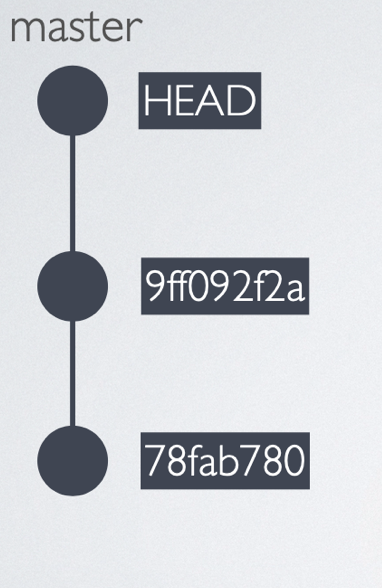

# GIT

Git works by recording the changes you make to a project, storing those changes, then allowing you to reference them as needed.

------

## Git Basic Commands

| Command                   | Description                                                  |
| :------------------------ | :----------------------------------------------------------- |
| `git init`                | Create repository (=Folder with superpower)                  |
| `git status`              | Show Status                                                  |
| `git add <Filename>`      | Add File                                                     |
| `git add .`               | Add all Files                                                |
| `git diff`                | check differences between the working directory and the staging area |
| `git commit`              | stores changes (opens vim - close with `:x` )                |
| `git commit -m "message"` | commit with message                                          |
| `git log`                 | show log                                                     |
| `git --help`              | get help                                                     |

### `git init`

Create repository (=Folder with superpower)

Creates hidden folder `.git`

------

 Git project can be thought of as having three parts:

- ***Working Directory***: where you’ll be doing all the work: creating, editing, deleting and organizing files
- ***Staging Area***: where you’ll list changes you make to the working directory
- ***Repository***: where Git permanently stores those changes as different *versions* of the project

We save changes with a ***commit*** (a "version" of the project)

------

### `git status`

Show Status - what has been changed

 git knows **4 States** of files:

1. Untracked - If you create a new file locally, it is first untracked. Git knows that it is there, but it won’t do anything with it.
2. Unmodified - All changes that you committed now have the status unmodified.
3. Modified - If you now change a file that has been added or committed before it is modified
4. Staged - If you add a file with the git add command, the file gets staged. git knows the file, has collected all changes and will include them in the next commit


------

### `git add`

Changes are not automatically added to the stagin area, you have to collect all your changes -> add them to the **Stagin Area**

`git add <Filename>` - Add File/Folder

`git add .`- Add everything

`git add *.txt` - Add all txt-Files

`git add <filename_1> <filename_2>` - add multiple files at once

------


------

### `git commit`

A *commit* is the last step in our Git workflow. A commit permanently stores changes from the staging area inside the repository.

```
git commit -m "<message>"
```

Standard Conventions for Commit Messages:

- Must be in quotation marks
- Written in the present tense
- Should be brief (50 characters or less) when using -m
- root-commit = first commit of the project

> `git commit` - will open vim. Write the commit message and close with :x

> best practice: keep commits small - eg one feature per commit

> instertations = lines changed

Each commit is has a commit-id

```
[master (root-commit) 6c61ecb] Creating the initial index.html
 1 file changed, 5 insertions(+)
 create mode 100644 index.html
```


------

### `git log`

shows commit-history

 Commits are stored chronologically in the repository and can be viewed with:

- ​		A 40-character code, called a *SHA*, that uniquely identifies the commit. This appears in orange text.
- ​		The commit author (you!)
- ​		The date and time of the commit
- ​		The commit message

If the log is getting too long, git will show a colon :at the end. This means: you are in scroll mode. You can scroll down or up with your arrow keys. Exit the scroll mode by typing q

- `$ git log --pretty=oneline`
- `-p` more Info
- `--oneline` short version

> `git lg`

`HEAD` is the active commit



------

### `git amend`

Change a commit - overwrite the last comit. rewrites the history

```
git commit --amend
```

> !careful - better only use it for lokal changes

------

### `git diff`

 check the differences between the working directory and the staging area with:

```
`git diff <filename>
```

- ​		Changes to the file are marked with a `+` and are indicated in green.

```
diff --git a/index.html b/index.html
index 0827234..ae7b97d 100644
--- a/index.html
+++ b/index.html
@@ -1,7 +1,8 @@
 <head>
   <title>Hallo erste Version…</title>
 Coole Urlaubswebseite
-ich muss etwas Ändern - eine Überschrift
+ich muss etwas Ändern - eine Überschrift.
 und noch eine Änderung
+...und noch eine.
 </head>
 
(END)
```

- `git diff --cached` shows staged changes
- `git diff <hash1> <hash2>` shows changes between two commits - order goes backwords! 

------

### Restrict commands to one or a few files

```
git diff <hash1> <hash2> -- index.html
```

```
git log -- index.html
```

also with wildcards:

```
git log -- index.*
```


------

## Undoing Changes

| Command                   | Description                                       |
| ------------------------- | ------------------------------------------------- |
| `git checkout -- .`       | discard all changes in all modified files         |
| `git checkout -- <file>`  | reset file                                        |
| `git reset --soft HEAD~1` | undo the last commit by resetting it              |
| `git reset --hard HEAD~1` | delete all changes of the last commit permanently |
| `git reset HEAD .`        | remove all files from the stage                   |
| `git reset HEAD`          |                                                   |

------

### `git checkout --`

`git checkout -- .` - discard all changes in all modified files (The dot is a shortcut for all files)

`git checkout -- <file>` - Resetting Modified Files: undo local changes,

------

### `git reset`

Remove all changes from the staging area:

```
git reset	
```

```
git reset <filename>
```


`git reset HEAD` - Removing files from the stage - If you have staged files, but you don’t want to commit them

`git reset HEAD .` - remove all files from the stage

`git reset --soft HEAD~1` - undo the last commit by resetting it. 

- The --soft flag has the effect that all changes of your last commit are not deleted, but they are now uncommitted modified files.
- The tilde ~ sign followed by a 1 means: take the HEAD (your current position in the githistory) and reset one commit from there

`git reset --hard HEAD~1` - delete all changes of the last commit and never see them again.

------

### Revert vs Reset

The difference is: if you reset a commit, you remove it; if you revert a commit, you add an additional commit to the history that undoes the changes.

- Use **Reset** when: You want to undo the last commit(s).

- Use **Revert** when: You want to undo a commit that is some commits back in the commit history and it is important that you see in the point in the commit history when the revert has been done (might be important in large projects with many developers).

------

## Backtracking

#### head commit

The commit you are currently on is known as the HEAD commit. In many cases, the most recently made commit is the HEAD commit.

#### See the HEAD commit

`git show HEAD`

------

#### Discard changes

`git checkout HEAD filename`
or shorthand: `git checkout -- filename` 

Discards changes in the working directory. To restore the file in your working directory to look exactly as it did when you last made a commit

------

#### Unstage a file from the staging area before it is commited 

`git reset HEAD filename`

Unstages file changes in the staging area. -> *resets* the file in the staging area to be the same as the HEAD commit.

Notice in the output, “Unstaged changes after reset”:`M  scene-2.txt`		M is short for “modification”

------
#### Resets to a previous commit

Git enables you to rewind to the part before you made the wrong turn. You can do this with:

`git reset *commit_SHA*`

Resets to a previous commit in your commit history. This command works by using the first 7 characters of the SHA of a previous commit. For example, if the SHA of the previous commit is 5d692065cf51a2f50ea8e7b19b5a7ae512f633ba, use:

`git reset 5d69206`

-> and then `git chekout *filename*`

------

### Temporarily switch to a different commit

[stackoverflow-post](https://stackoverflow.com/questions/34519665/how-to-move-head-forward-checkout-revet-reflog-reset/34519716#34519716)

If you want to temporarily go back to it, fool around, then come back to where you are, check out the desired commit:

```sh
# This will detach your HEAD, that is, leave you with no branch checked out:
git checkout 0d1d7fc32
```

Or to make commits , make a new branch:

```
git checkout -b old-state 0d1d7fc32
```

To go back to where you were, just check out the branch you were on again. (If you've made changes, as always when switching branches, you'll have to deal with them as appropriate. You could reset to throw them away; you could stash, checkout, stash pop to take them with you; you could commit them to a branch there if you want a branch there.)

#### Hard delete unpublished commits

If you want to really get rid of everything you've done since then, there are two possibilities. One, if you haven't published any of these commits, simply reset:

```sh
# This will destroy any local modifications.
# Don't do it if you have uncommitted work you want to keep.
git reset --hard 0d1d7fc32

# Alternatively, if there's work to keep:
git stash
git reset --hard 0d1d7fc32
git stash pop
# This saves the modifications, then reapplies that patch after resetting.
# You could get merge conflicts, if you've modified things which were
# changed since the commit you reset to.
```

If you mess up, you've already thrown away your local changes, but you can at least get back to where you were before by resetting again.

#### Undo published commits with new commits

On the other hand, if you've published the work, you probably don't want to reset the branch, since that's effectively rewriting history. In that case, you could indeed revert the commits. With Git, revert has a very specific meaning: create a commit with the reverse patch to cancel it out. This way you don't rewrite any history.

```sh
# This will create three separate revert commits:
git revert a867b4af 25eee4ca 0766c053

# It also takes ranges. This will revert the last two commits:
git revert HEAD~2..HEAD

#Similarly, you can revert a range of commits using commit hashes (non inclusive of first hash):
git revert 0d1d7fc..a867b4a

# Reverting a merge commit
git revert -m 1 <merge_commit_sha>

# To get just one, you could use `rebase -i` to squash them afterwards
# Or, you could do it manually (be sure to do this at top level of the repo)
# get your index and work tree into the desired state, without changing HEAD:
git checkout 0d1d7fc32 .

# Then commit. Be sure and write a good message describing what you just did
git commit
```

The [`git-revert` manpage](https://git-scm.com/docs/git-revert) actually covers a lot of this in its description. Another useful link is [this git-scm.com section discussing git-revert](https://git-scm.com/book/en/v2/Git-Tools-Advanced-Merging#_undoing_merges).

If you decide you didn't want to revert after all, you can revert the revert (as described here) or reset back to before the revert (see the previous section).

You may also find this answer helpful in this case:
[How can I move HEAD back to a previous location? (Detached head) & Undo commits](

------

## GIT Branches


A branch is a string of commits that is independent of the other commits.

- The master/main branch is usually the default branch.
- If you want to make changes independently from the other developers, you create a branch. When you are done, these can be merged back to the master branch.

------

Keep in mind:

- ​		Your goal is to update master with changes you made to fencing.
- ​		fencing is the giver branch, since it provides the changes.
- ​		master is the receiver branch, since it accepts those changes.

------

### Commands

| Command                       | Description                                                |
| :---------------------------- | :--------------------------------------------------------- |
| `git branch`                  | **Shows** all existing branches, marks the one you are on. |
| `git branch <newbranch>`      | **Creates** a new branch                                   |
| `git checkout <name>`         | **switch** branch                                          |
| `git checkout -b <newbranch>` | **Shorthand:** Create new branch and switch                |
| `git branch -d <oldbranch>`   | Delete branch                                              |
| `git branch -D <oldbranch>`   | Delete unmerged branch                                     |
| `git merge <name>`            | Merge branch into the active branch                        |
| `git branch -m <new_name>`    | rename branch                                              |

Branch names can’t contain whitespaces

------

#### Workflow: Merging a branch into master

1. you need to be on the master branch - `git checkout master`
2. Then, merge your branch into master - `git merge branchname`
3. You don’t need the merged branch anymore, so you can delete it. - `git branch -d branchname`

------

### Best Practice: 

- Always delete branches that you don’t need anymore. The less branches you have, the better:  less confusing. 
- Make it a habit to delete old branches before you create a new one.

- Give meaningful but short branch names. Describe the features or bugfix you are working on

- usually use `-` between words: `user-login`, `fix-404-error`

- a common naming strategy is, to use `feature/` or `bugfix/` as a prefix:

  `feature/user-login`, `bugfix/404-error`

- if the team uses a ticket system, e.g. Jira, you can use the project name and ticket number to identify the task you are working on

  `feature/MYPROJECT-347-user-login`,`bugfix/MYPROJECT-347-404-error`

- example for a popular branching strategy for larger teams with continuous delivery: [A successful Git branching model](https://nvie.com/posts/a-successful-git-branching-model/)


------

### Merge conflict

```
git merge branchname
```

We must fix the merge conflict.

```
<<<<<<< HEAD
master version of line
=======
fencing version of line
\>>>>>>> fencing
```

Git asks us which version of the file to keep

Delete **all of Git’s special markings** including the words HEAD and fencing. If any of Git’s markings remain, for example, >>>>>>> and =======, the conflict remains.

In Git, branches are usually a means to an end. You create them to work on a new project feature, but the end goal is to merge that feature into the master branch. After the branch has been integrated into master, it has served its purpose and can be deleted.

------

## Git stash

------

## Git Setup

### disable git pager

disable full-screen display for branch (similar for other commands)

```
 git config --global pager.branch false
```


