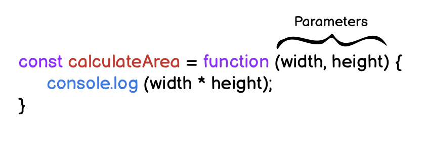
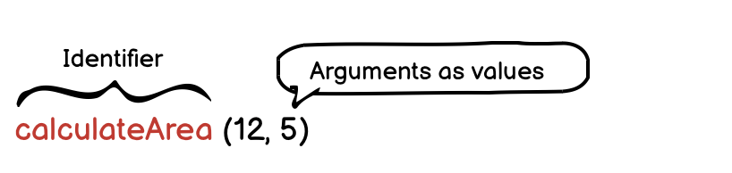

# Functions

[https://developer.mozilla.org/en-US/docs/Web/JavaScript/Guide/Functions](https://developer.mozilla.org/en-US/docs/Web/JavaScript/Guide/Functions)

## Function Declaration

### A) Function Statement

A function statement has a name. The declaration consists of:

- The function keyword
- The name of the function, or its identifier, followed by parentheses.
- A function body,enclosed in the function’s curly brackets { }

```js
function greetWorld() {
  console.log('Hello, World!');
}

greetWorld();  // -> calling the Function
```

------

### B) Function Expressions - Anonymus 

- Another way to define a function - (anonymous function) 
- often stored in a variable in order to refer to it
- name is usually omitted
- it is common practice to use const as the keyword to declare the variable
- Unlike function declarations, function expressions are not hoisted so they cannot be called before they are defined.
- for debugging: you don't see the function-name in the console as part of the error message if it is an anonomys function


```js
const rectangleArea = function (width, height)  {
  let area = width * height;
  return area;
}
```

------

### C) Arrow Functions

[MDN Arrow Functions](https://developer.mozilla.org/en-US/docs/Web/JavaScript/Reference/Functions/Arrow_functions)

- ES6 introduced. 
- removes the need to type out the keyword `function`
- Instead, you first include the parameters inside the ( ) and then add an arrow => that points to the function body surrounded in { } like this:

```js
const rectangleArea = (width, height) => {
  let area = width * height;
  return area;
};
```

- difference between arrow function and regular function:

  `this` refers to the same content inside of them as outside of them

------

### D) Concise Body Arrow Functions

The most condensed form to refactor arrow function syntax is **concise body**.

1. Functions that take only a single parameter do not need parentheses. If a function takes zero or multiple parameters, parentheses are required.

   ```js
   // ZERO PARAMETERS
   const functionName = () => {...};
   
   // ONE PARAMETER
   const functionName = paramOne => {...};
   
   // TWO OR MORE PARAMETERS
   const functionName = (paramOne, paramTwo) => {...};
   ```

2. function body composed of a single-line block does not need curly braces. Whatever that line evaluates will be automatically returned. The contents of the block should immediately follow the arrow => and the return keyword can be removed. This is referred to as implicit return.

   ```js
   // SINGLE-LINE BLOCK
   const sumNumbers = number => number + number;
   
   // MULTI-LINE BLOCK
   const sumNumbers = number => {
     return number + number;
   }
   ```

Examples:

```js
const getFive = () => 5
const addFive = a => a + 5
const divide = (a, b) => a / b
```

```js
const dayIsWednesday = day => day === 'Wednesday' ? true : false;

const circleArea = radius => Math.PI * radius * radius;

const doubler = item => item * 2;

const multiplier = (item, multi) => item * multi;
multiplier(5, 3); // returns 15
```

also with more complex teranry expressions:

```js
const getWinner = (cChoice, pChoice) =>
  cChoice === pChoice
    ? RESULT_DRAW
    : (cChoice === ROCK && pChoice === PAPER) ||
      (cChoice === PAPER && pChoice === SCISSORS) ||
      (cChoice === SCISSORS && pChoice === ROCK)
    ? RESULT_PLAYER_WINS
    : RESULT_COMPUTER_WINS;
```

### Arrow Functions Overview


**1) Default syntax:**

```js
const add = (a, b) => { 
  const result = a + b;    
  return result; 
}
// like in "normal" functions, parameters and return statement are OPTIONAL!};
```

*No function keyword, parentheses around parameters/ arguments*

**2) Shorter parameter syntax, if exactly one parameter is received:**

```js
const log = message => { console.log(message) }; 
// could also return something of course - this example just doesn't};
```

*Parentheses around parameter list can be omitted (for exactly one argument).*

**3) Empty parameter parentheses if NO arguments are received:**

```js
const greet = () => {console.log('Hi there!')};
```

*Noteworthy: Parentheses have to be added (can't be omitted)*

**4) Shorter function body, if exactly one expression is used:**

```js
const add = (a, b) => a + b;
```

*Curly braces and return statement can be omitted, expression result is always returned automatically*

**5) Function returns an object:**

```js
const loadPerson = pName => ({name: pName });
```

*Extra parentheses are required around the object, the curly braces would otherwise be interpreted as the function body!*

------

## Parameters & Arguments

**Parameters** allow functions to accept input(s) and perform a task using the input(s)



**Arguments** are the values that are passed to the function when it is called.

- Functions should not be used for input/output -> recieves parameter - returns output
- Function should be as simple as possible (ONE task)



------

## Hoisting

allows access to function declarations before they’re defined.  Hoisting is NOT considered good practice

- [Hoisting - MDN](https://developer.mozilla.org/en-US/docs/Glossary/Hoisting)

```js
console.log(greetWorld()); // Output: Hello, World!

  function greetWorld() {
    console.log('Hello, World!');	
  }
```

------

## Default Parameters

[MDN: Default parameters](https://developer.mozilla.org/en-US/docs/Web/JavaScript/Reference/Functions/Default_parameters)

To have a default/fallback value if no argument passed or if the argument is undefined.

```js
function greeting (name = 'stranger') {
  console.log(`Hello, ${name}!`)
}

greeting('Nick') // Output: Hello, Nick!
greeting() // Output: Hello, stranger!
```

Old Syntax:

```js
name = name || "Default Value"
//But 0 is also undefined -> new Syntax is better!!
```


```js
function add(a, b = 0) {
  return a + b
}

// is the same as
const add = (a, b = 0) => a + b

// is the same as
function add(a, b) {
  b = b === undefined ? 0 : b
  return a + b
}
```

- good practice to put them last -› if you dont pass an argument, the default value will be applied

- you can also refer to one of the arguments that came before:

  ```js
  const winner = (cChoice, pChoice = cChoice === 'ROCK' ? PAPER : DEFAULT_USER_CHOICE) => {...}
  ```

------

## Return

- Return keyword followed by the value
- By default that resulting value is `undefined`.
- When a return statement is used in a function body, the execution of the function is stopped and the code that follows it will not be executed.

```js
function rectangleArea(width, height) {
  if (width < 0 || height < 0) {
    return 'You need positive integers to calculate area!';
  }
  return width * height;
}
```

#### Returning Boolean Values from Functions:

```js
if (a === b) { return true } else { return false };
// can be simplified as:
return a === b;  
```

------

- g else, eg the browser event-listener
- you can use any name, ofthe `cb` is used

```js
const sumUp = (resultHandler, ...numbers) => { // resultHandler is the callback
  let sum = 0;
  for (const num of numbers) {
    sum += validateNumber(num);
  }
  
  resultHandler(sum);
};

const showResult = (result) => {
  alert('The result after adding all numbers is: ' + result);
};

sumUp(showResult, 1, 5, -3, 6, 10);
```

------

## Callback Functions

pass a function as the parameter to another function -› a pointer to a function

- a lot of the build-in functions use theese

- either in-place or stored in a variable
- you never call the function, called by somthing else, eg the browser event-listener
- you can use any name, ofthe `cb` is used

```js
const sumUp = (resultHandler, ...numbers) => { // resultHandler is the callback
  let sum = 0;
  for (const num of numbers) {
    sum += validateNumber(num);
  }
  
  resultHandler(sum);
};

const showResult = (result) => {
  alert('The result after adding all numbers is: ' + result);
};

sumUp(showResult, 1, 5, -3, 6, 10);
```

------

## `bind()`

[https://developer.mozilla.org/en-US/docs/Web/JavaScript/Reference/Global_objects/Function/bind](https://developer.mozilla.org/en-US/docs/Web/JavaScript/Reference/Global_objects/Function/bind)

functions are objects, and the have special methods attached

```js
const combine = (resultHandler, operation, ...numbers) => {
  let sum = 0;
  for (const num of numbers) {
    if (operation === 'ADD') {
      sum += validateNumber(num);
    } else {
      sum -= validateNumber(num);
    }
  }
  resultHandler(sum);
};

const showResult = (messageText, result) => {
  alert(messageText + ' ' + result);
};

combine(
  showResult.bind(this, 'The result after adding is:'),
  'ADD',
  1,
  5
);

combine(
  showResult.bind(this, 'The result after subtracting is:'),
  'SUBTRACT',
  1,
  5
);
```

bind will create a new function-reference, that has the provided arguments

-› prepared for a future execution

takes two arguments - first `this` and then the arguments

```js
function calculate(operation) {
  const enteredNumber = getUserNumberInput();
  const initialResult = currentResult;
  let operator;
  if (operation === 'ADD') {
    currentResult += enteredNumber;
    operator = '+';
  } else if (operation === 'SUBTRACT') {
    currentResult -= enteredNumber;
    operator = '-';
  } else if (operation === 'MULTIPLY') {
    currentResult *= enteredNumber;
    operator = '*';
  } else {
    currentResult /= enteredNumber;
    operator = '/';
  }
  createAndWriteOutput(operator, initialResult, enteredNumber);
  writeToLog(operation, initialResult, enteredNumber, currentResult);
}

addBtn.addEventListener('click', calculate.bind(this, 'ADD'));
subtractBtn.addEventListener('click', calculate.bind(this, 'SUBTRACT'));
multiplyBtn.addEventListener('click', calculate.bind(this, 'MULTIPLY'));
divideBtn.addEventListener('click', calculate.bind(this, 'DIVIDE'));
```

------

## `call()` / `apply()`

immediatly execute the function 

------

## Chaining Methods in JavaScript

Combine methods. For example array-methods:  `map()` and `reduce()` :

```js
const originalArray = [{price: 10.99}, {price: 5.99}, {price: 29.99}];

const transformedArray = originalArray.map(obj => obj.price); 
// produces [10.99, 5.99, 29.99]

const sum = transformedArray.reduce((sumVal, curVal) => sumVal + curVal, 0); // => 46.97
```

> You could skip the map step and just add the extraction logic to `reduce()`:
>
> ```js
> const originalArray = [{price: 10.99}, {price: 5.99}, {price: 29.99}];
> 
> const sum = originalArray.reduce((sumVal, curVal) => sumVal + curVal.price, 0); // => 46.97
> ```

**method chaining**:

```js
const originalArray = [{price: 10.99}, {price: 5.99}, {price: 29.99}];

const sum = originalArray.map(obj => obj.price).reduce((sumVal, curVal) => sumVal + curVal, 0); // => 46.97
```

We call `.reduce()` directly on the result of `map()` (produces an array, that's why this is possible). 

-> we can avoid storing the mapped array in a separate constant or variable
