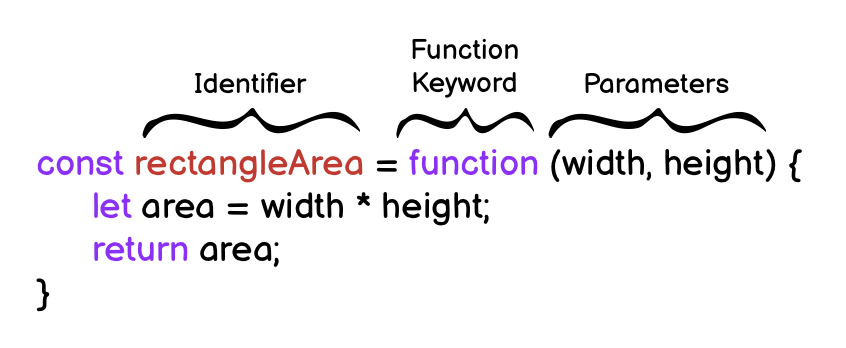

# Functions

## Function Declaration

### A) Function Statement

A function statement has a name. The declaration consists of:

- The function keyword
- The name of the function, or its identifier, followed by parentheses.
- A function body,enclosed in the function’s curly brackets { }

```js
function greetWorld() {
  console.log('Hello, World!');
}

greetWorld();  // -> calling the Function
```

------

### B) Function Expressions - Anonymus 

- Another way to define a function - (anonymous function) 
- name is usually omitted
- often stored in a variable in order to refer to it.
- it is common practice to use const as the keyword to declare the variable
- Unlike function declarations, function expressions are not hoisted so they cannot be called before they are defined.



```js
const rectangleArea = function (width, height)  {
  let area = width * height;
  return area;
}
```

------

### C) Arrow Functions

- ES6 introduced. 
- removes the need to type out the keyword `function`
- Instead, you first include the parameters inside the ( ) and then add an arrow => that points to the function body surrounded in { } like this:

```js
const rectangleArea = (width, height) => {
  let area = width * height;
  return area;
};
```

------

### D) Concise Body Arrow Functions

The most condensed form to refactor arrow function syntax is **concise body**.

1. Functions that take only a single parameter do not need parentheses. If a function takes zero or multiple parameters, parentheses are required.

   ```js
   // ZERO PARAMETERS
   const functionName = () => {...};
   
   // ONE PARAMETER
   const functionName = paramOne => {...};
   
   // TWO OR MORE PARAMETERS
   const functionName = (paramOne, paramTwo) => {...};
   ```

2. function body composed of a single-line block does not need curly braces. Whatever that line evaluates will be automatically returned. The contents of the block should immediately follow the arrow => and the return keyword can be removed. This is referred to as implicit return.

   ```js
   // SINGLE-LINE BLOCK
   const sumNumbers = number => number + number;
   
   // MULTI-LINE BLOCK
   const sumNumbers = number => {
     return number + number;
   }
   ```

Examples:

```js
const dayIsWednesday = day => day === 'Wednesday' ? true : false;

const circleArea = radius => Math.PI * radius * radius;

const doubler = item => item * 2;

const multiplier = (item, multi) => item * multi;
multiplier(5, 3); // returns 15
```

------

## Parameters & Arguments

**Parameters** allow functions to accept input(s) and perform a task using the input(s)


**Arguments** are the values that are passed to the function when it is called.

- Functions should not be used for input/output -> recieves parameter - returns output
- Function should be as simple as possible (ONE task)


------

## Hoisting

allows access to function declarations before they’re defined.  Hoisting is NOT considered good practice

- [Hoisting - MDN](https://developer.mozilla.org/en-US/docs/Glossary/Hoisting)

```js
console.log(greetWorld()); // Output: Hello, World!

  function greetWorld() {
    console.log('Hello, World!');	
  }
```

------

## Default Parameters

To have a default/fallback value if no argument passed or if the argument is undefined.

```js
function greeting (name = 'stranger') {
  console.log(`Hello, ${name}!`)
}

greeting('Nick') // Output: Hello, Nick!
greeting() // Output: Hello, stranger!
```

Old Syntax:

```js
name = name || "Default Value"
//But 0 is also undefined -> new Syntax is better!!
```

------

## Return

- Return keyword followed by the value
- By default that resulting value is `undefined`.
- When a return statement is used in a function body, the execution of the function is stopped and the code that follows it will not be executed.

```js
function rectangleArea(width, height) {
  if (width < 0 || height < 0) {
    return 'You need positive integers to calculate area!';
  }
  return width * height;
}
```

#### Returning Boolean Values from Functions:

```js
if (a === b) { return true } else { return false };
// can be simplified as:
return a === b;  
```

