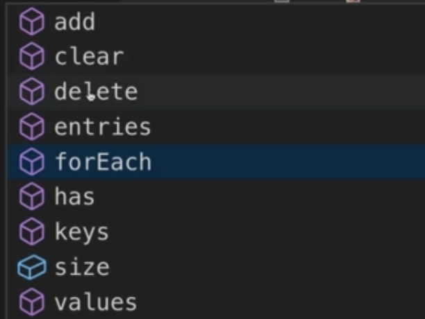
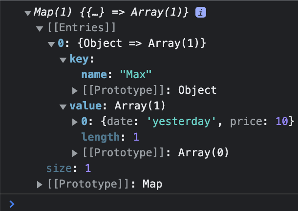
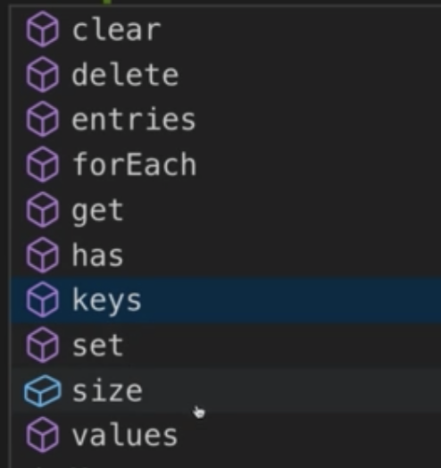

# Maps & Sets

- not so important…
- you can allways convert to an array with `Array.from`

| Arrays                                                       | Sets                                                         | Maps                                                         |
| ------------------------------------------------------------ | ------------------------------------------------------------ | ------------------------------------------------------------ |
| Store (nested) data of any kind and length                   | Store (nested) data of any kind and length                   | Store key-value data of any kind and length. Any Key-values are allowed |
| Iterale,  many special array-methods available               | iterable, also some special set methods availabe             | iterable, also some special map methods availabe             |
| Order is guranteed. Duplicates are allowed. Zero-based index to access elements | Order is NOT guaranteed. Duplicates are NOT allowed. No index-based access | Order is  guaranteed. Duplicates are NOT allowed. Key-based access |

## Sets

- no duplicates
- can be useful to manage unique data

##### Create:

- ```js
  const mySet = new Set(['Hi', 'from', 'set!']);
  ```

- to get a value

  ```
  mySet.has('Hi')
  ```

##### `.add`

- add a value

  ```js
  mySet.add("yeah")
  ```

  - if you add a value that alredy exist, it will not be added. Values are unique in sets

##### `.entries()`

- returns an iterable of arrays with the value twice (to be the same as the -tentries-mehod of maps)


##### `.values()`

- retuns the values (iteratable)

##### `.delete('Hi')`

- delete a value




## Maps

- can have anything as a key (eg. an object)
- key-value-pairs
- can have anything as a key
- order is guarented (unlike in objects)
- for example to attach extra information to an object

```
const person1 = { name: 'Max' };
const person2 = { name: 'Manuel' };

const personData = new Map([[person1, [{ date: 'yesterday', price: 10 }]]]);
```



I.e. you don't have to do:

```js
const person1 = {id: 'p1', ...};
const personData = { p1: [ ... ]};
console.log(personDate[person.id])
```

get data:

```
console.log(personData.get(person1));
```

set data

```js
personData.set(person2, [{ date: 'two weeks ago', price: 100 }]);
```


output all information of the map - `for...of`

```js
for (const [key, value] of personData.entries()) {
  console.log(key, value); // .entries() returns an array with key/value
} 

for (const key of personData.keys()) {
  console.log(key);
}

for (const value of personData.values()) {
  console.log(value);
}
```

methods & properties:



------

## WeakSet

- data has to be an object
- only has `add`, `delete` and `has` -methods

you can  clear the weak-set and all the objects  will be garbage-collected

```js
// ... some operations
person = null;
```

## WeakMap

- also for garbage-collection

```js
const personData = new WeakMap();
personData.set(person, 'Extra info!');

person = null;

console.log(personData);
```


