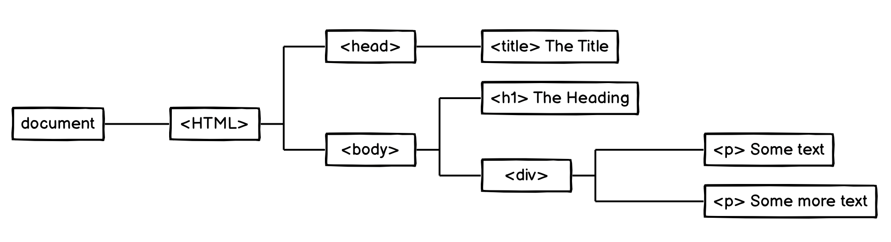

# The DOM 

The DOM stands for "Document Object Model" 

- tree-like structure that is a representation of the HTML document, the relationship between elements 
- contains the content and properties of the elements.
- Think of the DOM as the link between an HTML web page and scripting languages.
- [DOM Introduction](https://developer.mozilla.org/en-US/docs/Web/API/Document_Object_Model/Introduction)
- [Section 8.2 Parsing HTML documents](https://www.w3.org/TR/html5/syntax.html#parsing) from the W3C's HTML Documentation
- [DOM Specification](https://www.w3.org/standards/techs/dom#w3c_all) on W3C
- [HTML Document Object Model mentioned in the ECMAScript Specification](https://www.ecma-international.org/ecma-262/#sec-global-object) - the language specification used by JavaScript

## Example:



```html
<html>
	<head>
		<title>The Title</title>
  </head>
 
  <body>
  	<h1>The heading</h1>
  	<div>
  		<p>Some text</p>
  		<p>Some more text</P>
  	</div>
  </body>
</html>
```

-  a **node** is the equivalent of each family member in a family tree. 
-  the top-most node is called the ***root node*,** and it represents the HTML document. 
-  A ***parent node*** is the closest connected node to another node in the direction towards the root.
-  A ***child node*** is the closest connected node to another node in the direction away from the root.

There are nine different types of node objects in the DOM tree, eg  [*Element*](https://developer.mozilla.org/en-US/docs/Web/API/Element),  [*Text*](https://developer.mozilla.org/en-US/docs/Web/API/Text), etc.

## The document keyword

- The `document` object is provided by the browser and is a representation of the HTML document. This is *not* provided by the JavaScript language.

- The `document` keyword gives access to the root of the DOM in JavaScript


https://developer.mozilla.org/en-US/docs/Web/API/Document

------

## The window Keyword

Global top-element -> the active Browser Window/Tab

- Acts as global storage for script. Also provides access to window-specific properties and methods. E.g.:

  -  you have direct access to `alert()` correct would be: `windows.alert()`

    > the browser always adds `windows.` in front of a function if that funct can't be found anywhere else

- also contains the Document-object, events, methods, outerHeight, outerWidth, etc

------

## Nodes and NodeList

Every element in the DOM is a **node**. This is represented by a **Node** object.

- A **NodeList object** is a list or collection of nodes extracted from a document .It is an array-*like* collection of objects (but is not an array)

- has a **length** property and an **index**(0, 1, 2, 3, ...) to access each item,

- You can loop over a NodeList with either its `.forEach()` method, or a `for` loop (also `for...of`)

- You cannot use Array methods, like `map()`, `filter()`,`reduce()`,`push()`, `pop()`, or `join()`

- If you want to use an array method, transform it into an array first:

  ```js
  const divs = document.querySelectorAll('div')
  divs.forEach(div => {
  	/* ... */
  }) // this works
  
  divs.map(div => { /* ... */ }) // throws error
  
  // turn NodeList into array first:
  [...divs].map(div => { /* ... */ })
  ```

## Node Types

[https://developer.mozilla.org/en-US/docs/Web/API/Node/nodeType](https://developer.mozilla.org/en-US/docs/Web/API/Node/nodeType)

There are 12 node types. In practice we usually work with 4 of them:

- **document** - the whole document is formally a DOM node as well

- **element nodes** - ("Elements") HTML-tags, the tree building blocks -> most important

- **text nodes** - represents text content in an element or attribute 

  (whitespace in the HTML-file is also added as text-nodes but not rendered to screen)

- **attribute nodes** - atteribute of an element

- **comments** - won’t be shown, but JS can still read it

> DOM Nores are JavaScript objects

## Elements

- have specials properties and methods (depending on the kind of element)
- can be selected vie JavaScript
- can be created and removed via JavaScript
