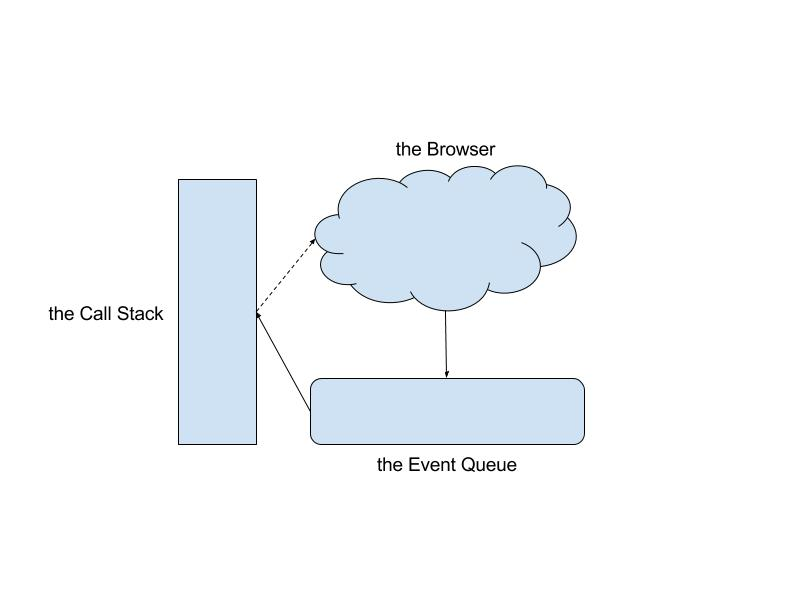

# Async Javascript

## Asynchronous?

JavaScript is single threaded, meaning that two bits of script cannot run at the same time; they have to run one after another.This is called **blocking**; 

## Single Threading

[Wikipedia article on Threading](https://bit.ly/2Nwu4Rd)

JavaScript can "process" one command at a time. - is **single-threaded** 

#### The Call Stack

The JavaScript engine keeps a call stack (basically a list) of the functions that are running. When a function is invoked, it is added to the list. When all of the code inside a function has been run, then the function is removed from the call stack.

- A function doesn't have to complete before another function is added to the call stack.

- item on the stack are called **frames**

### Further Research

- [Call stack](https://developer.mozilla.org/en-US/docs/Glossary/Call_stack) on MDN
- [Call stack](https://en.wikipedia.org/wiki/Call_stack) on Wikipedia

------

## The JavaScript Event Loop

The simplest explanation of JavaScript's *concurrency model* uses two rules:

1. If some JavaScript is running, let it run until it is finished ("run-to-completion"). 
2. If no JavaScript is running, run any pending event handlers.

Since most JavaScript is run in response to an event, this is known as an *event loop*: Pick up the next event, run its handler, and repeat.

There are three parts you have to think about around the event loop:

- the Call Stack
- Web APIs/the browser
- an Event Queue




Not all of the code that we write is 100% *JavaScript* code: 

- Some of the code is interacting with the Web APIs (also known as "browser APIs"). 
- for example: `.addEventListener()` and `setTimeout()` are Web APIs.

IMPORTANT: 

1) current synchronous code runs to completion, and 
2) events are processed when the browser isn't busy. 
3) Asynchronous code (such as loading an image) runs outside of this loop and sends an event when it is done.


```js
const pageFooter = document.querySelector('#page-footer');

pageFooter.addEventListener('click', function iceCream () {
    const footerDetails = document.querySelector('#details');

    footerDetails.textContent = 'Everyone should eat ice cream!';
});
```

When this code is run, the `iceCream` function is given to the browser. When the `<footer>` is clicked, the code moves to the Queue. Then, when the Call Stack is empty, `iceCream` is moved over to the Call Stack and invoked.


------

Any asynchronous code (like `setTimeout` or the function passed to `.addEventListener()`) is handled by the browser. When this asynchronous code is ready to be executed, it's moved to the queue where it waits until the Call Stack is empty. Whenever the Call Stack is empty, code moves from the Queue over to the Call Stack and gets executed.

### Further Research

- [Concurrency model and Event Loop](https://developer.mozilla.org/en-US/docs/Web/JavaScript/EventLoop)
- [Events and Handlers Overview](https://developer.mozilla.org/en-US/docs/Web/Guide/Events/Overview_of_Events_and_Handlers)
- [What the heck is the event loop anyway? by Philip Roberts on YouTube](https://www.youtube.com/watch?v=8aGhZQkoFbQ)


------

## Threads

JavaScript is traditionally single-threaded. Even with multiple cores, you could only get it to run tasks on a single thread, called the **main thread**.

```html
Task A --> Task B --> Task C
```

[Web workers](https://developer.mozilla.org/en-US/docs/Web/API/Web_Workers_API) allow you to send some of the JavaScript processing off to a separate thread, called a worker.

```html
  Main thread: Task A --> Task C
Worker thread: Expensive task B
```

Web workers are pretty useful, but they do have their limitations. A major one is they are not able to access the [DOM](https://developer.mozilla.org/en-US/docs/Glossary/DOM) 

------

## Syntax to write async requests

1. nested callbacks -› gets very unreadable
2. `.then` - / Promises
3. async-await

[MDN Choosing_the_right_approach](https://developer.mozilla.org/en-US/docs/Learn/JavaScript/Asynchronous/Choosing_the_right_approach)
