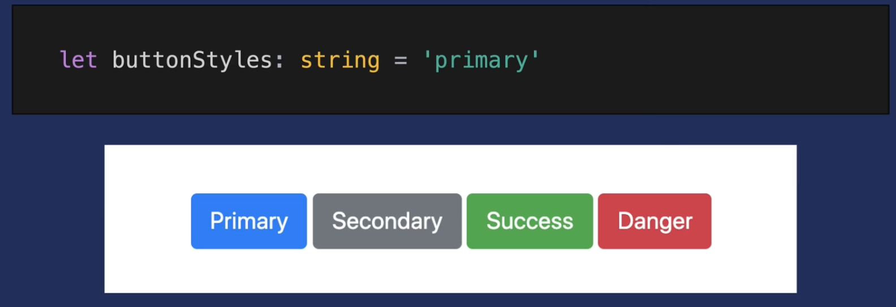

# Typescript


[https://www.typescriptlang.org/](https://www.typescriptlang.org/)

Only during developement - not during runtime

------

```
npm install -g typescript
```

```
tsc
```

------

#### vscode

- eslint
- path intellisense
- prettier


# Type Fundamentals

One of TypeScript’s fundamental concepts is the ability to define static types that can be used to enhance development

## Overview of Types

### Basic Types

As a quick review, common JavaScript types that we often encounter in our code include:

- String
- Number - only one number type - (no int, float)
- Boolean - not truthy values - just true/false
- Array
- Function
- Object

More about what types and data structures exist in JavaScript: [MDN’s documentation on JavaScript Data Types and Data Structures](https://developer.mozilla.org/en-US/docs/Web/JavaScript/Data_structures).

### New Types from TypeScript

 TypeScript also offers additional types commonly found in other programming languages such as:

- `any` - allows you to assign any type to the variable = disabling type checking

- `tuple` - allows you to define an array that contains a fixed number of elements with certain types

- `enum` - allows you to define friendly names to sets of numeric values 

  ```typescript
  enum ArrowKeys {
  	Up = 1,
  	Down = 2,
  	Left = 3,
  	Right = 4
  }
  ```

and more: check out the [official documentation on TypeScript Basic Types](https://www.typescriptlang.org/docs/handbook/basic-types.html)

## How to Apply a Type to a Variable

add a colon `:`

### String, Number and Booleans

this is accomplished by appending our variable with the `:` and the desired type (lowercase):

```typescript
let stageName: string = 'A Beautiful Vue'
let roomSize: number = 100
let isComplete: boolean = false
```

#### Type Inteference

not necessary to write: (possible, but bad practice)

```tsx
let number1: number = 5
```

enough to write

```tsx
let number1 = 5
```

------

### Arrays

TypeScript is about being more explicit about what types are expected in the array, so the notation for defining arrays is a little bit different. 

```tsx
let shoppingList: string[] = ['apple', 'bananas', 'cherries']
```

### Function

there are two key parts to keep in mind:

- Parameters
- Return

this

```js
let generateFullName = (firstName, lastName) => {
  return firstName + ' ' + lastName
}
```

becomes this:

- define the types expected on our parameters,
- define what type of data we expect to get from the function, which we do by using the colon (i.e., `:`) after the parameters.

```tsx
let generateFullName = (firstName: string, lastName: string): string => {
  return firstName + ' ' + lastName
}
```

### Object

If we wanted to define the types that are expected for each key-value pair in the person object, we define the types through the following syntax:

```tsx
let person: {
  name: string;
  age: number;
  activeAvenger: boolean;
  powers: string[];
} = {
  name: 'Peter Parker',
  age: 20,
  activeAvenger: true,
  powers: ['wall-crawl', 'spider-sense']
}
```

the type is not a traditional object because there are semi-colons (i.e., `;`) instead of commas (i.e., `,`).

#### best practice:

not right:

```tsx
const person: object = {
  name: 'Maximilian',
  age: 30
};
```

you can write: (the same)

```tsx
const person: {} = {
  name: 'Maximilian',
  age: 30
};
```

define, but not best-practice:

```tsx
const person: {
  name: string;
  age: number
} = {
  name: 'Maximilian',
  age: 31
};
```

looks lika js-object, but has `;` and key-type-pairs

better: just let ts infer the types:

```tsx
const person = {
  name: 'Maximilian',
  age: 30
};
```

------

# Defining Custom Types

When you want to define custom types in TypeScript, there are two methods that account for most scenarios early on: `type` and `interface`.

##  `type`

In its simplest form, `type` allows you to define an alias that refers to a specific way that the data should be shaped. 

- declare a type

	

### How to use `type`?

Similar to declaring a variable, you use `type` as a declaration of the variable type.

```typescript
type buttonType = 'primary'
```

### union operator - define multiple values

 to allow a type to contain multiple values, use the union operator. 

The union operator can be identified by a single pipe `|` 

```tsx
type buttonType = 'primary' | 'secondary' | 'success' | 'danger'
```

 we can ensure that all `buttonType` variables have the correct value!

```typescript
// TypeScript will report an error because this doesn't exist in the type!
const errorBtnStyles: buttonType = 'error'

// This variable is type safe!
const dangerBtnStyles: buttonType = 'danger'
```

------

## Interface

Think about it is a way to define a `type` for an object. 

Just like a `type`, you declare an `interface` by prefixing the variable name with `interface`:

```typescript
interface Hero {
	name: string;
	age: number;
	activeAvenger: boolean;
	powers: string[];
}
```

### use `type` in an interface

```js
type ComicUniverse = 'Marvel' | 'DC'

interface Hero {
	name: string;
	age: number;
	activeAvenger: boolean;
	powers: string[];
	universe: ComicUniverse;
}
```

> To get started, use `interface` for objects, `type` for everything else…

------

# 