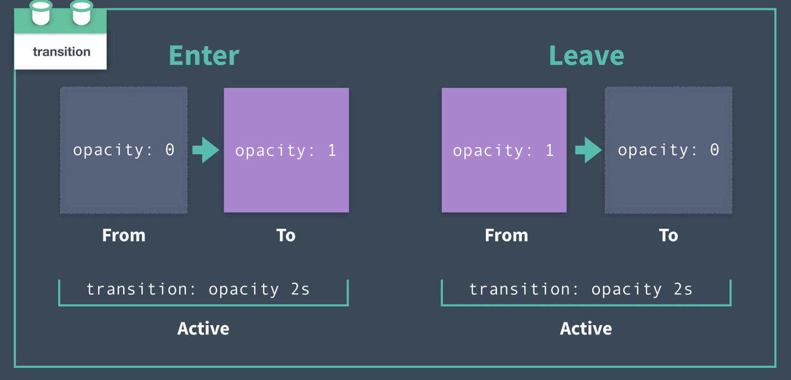
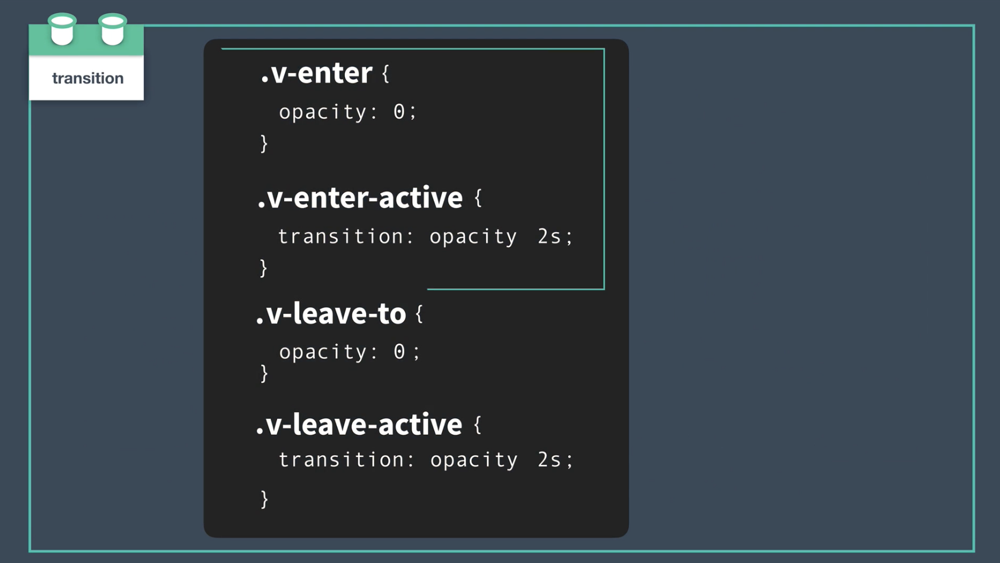

# Vue Transition

- direct focus
- inspure actions we want the user to take
- create flow
- show care

> We can harness the power of animation to focus our user’s attention. And once we have it, we can direct it where we want it to go.
>
> creating flow by mimicking nature
>
> 
>
> We can use animation to create a sense of physical space and time within or application, where elements transition between positions and states over a predictable duration. When this is implemented well, the user gains a sense of familiarity with the “world” of our app. They understand where things live within it so they better remember how to find what they need when they need it, and they understand how the app behaves so they don’t get disoriented , frustrated, or exhausted by it.

------

## Transition

A transition is when something *transitions* from _____ to _____. From *off* the screen to *on*, from *here* to *there*, from *open* to *closed*, from *visible* to *invisible*, and so on.

In Vue, we use the built-in `transition` component, which serves as a wrapper that gives us classes we can hook into during the lifecycle of the transition.

 


often `v-enter-to ` and `v-leave` are not nescessary since the element usually has a default state




------

## Ask yourself

using these questions to guide our decisions:

- **What should the default style be?**
- **What should the starting style be?**
- **What should the active entering style be?**
- **What should the ending style be?**
- **What should the active leaving style be?**

### Default Style

##### **What should the default style be?**

how should the element/component appear when it is *not* transitioning?


 next question we ought to ask ourselves when designing a transition is: **What should the starting style be?**

### Entering Transition

**What should the starting style be?**

```css
    .v-enter { /* starting style */
    	opacity: 0;
    }
```

##### **What should the active style be?**

- How long should the transition take? 

- Should we speed up or slow down the transition during the course of the transition?

- use the `v-enter-active` class to define the behavior of the transition while it is *active*, while it is *happening*  

- ```css
  .v-enter { /* starting style */
   	opacity: 0;
   }
   
   .v-enter-active { /* active entering style */
   	transition: opacity 2s ease-in; 
   }
  ```

## Leaving Transition

##### **What should the ending style be?**

 set that ending style in the `v-leave-to` class.

```css
 .v-enter { /* starting style */
    	opacity: 0;
    }
    
    .v-enter-active { /* active entering style */
    	transition: opacity 2s ease-in; 
    }
    
    .v-leave-to { /* ending style */
    	opacity: 0;
    }
```

##### **What should the active leaving style be?**

we define this in the `v-leave-active` class, setting its duration, easing, etc.

```css
    .v-enter { /* starting style */
    	opacity: 0;
    }
    
    .v-enter-active { /* active entering style */
    	transition: opacity 2s ease-in; 
    }
    
    .v-leave-active { /* active leaving style */
    	transition: opacity 2s ease-out; 
    }
    
    .v-leave-to { /* ending style */
    	opacity: 0;
    }
```

## Additional Transition Classes

https://vuejs.org/v2/guide/transitions.html


 you’ll also find the `v-enter-to` and `v-leave` classes. 

 You’ll only ever need to use these classes when the style you are transitioning to (`v-enter-to`) or away from (`v-leave`) is different from the inherent style of the element OR if you run into browser compatibility issues, where these classes may come in handy for you.


https://www.w3schools.com/css/css3_transitions.asp

https://www.w3schools.com/cssref/css3_pr_transition-timing-function.asp

------


### Named Transitions

```vue
  <transition name="fade">
      <div v-if="isOpen" class="modal">
        <button @click="toggleModal">Close</button>
      </div>
    </transition>
```

The `name` attribute gives the transition a name of `fade`. This allows  to prepend our transition’s classes with that name (`fade-enter` instead of `v-enter`)

Named transitions help us stay organized as our app scales, and makes our transitions more reusable. We may want to use this `fade` transition on other elements throughout our app, which is why we ought to be naming our transitions based on what they *do* instead of what element they target

```css
.fade-enter {
  opacity: 0;
}
.fade-enter-active,
.fade-leave-active {
  transition: opacity 1.5s ease-out;
}

.fade-leave-to {
  opacity: 0;
}
```

------

## Page Transitions

create global transition in App.vue


wrap `router-view` with Vue’s `transition` component and use the  transition here to animate the page component we’re routing to.

```vue
<template>
	<div id="app">  
		<div id="nav">
			<router-link to="/">Modal</router-link> |
			<router-link to="/about">About</router-link>
		</div>
  
		<transition name="fade">
			<router-view />
      </transition>
	</div>
</template>
```


## Transition Modes

- `in-out`: The new element transitions in, then when complete, the current element transitions out.
- `out-in`: The current element transitions out, then when complete, the new element transitions in. -> most common
- (By default, the current element and new element will transition in and out simultaneously)

## Another Use Case

It’s worth noting that we aren’t limited to using these sort of transitions only when routing between pages. We may want to transition between components that are using the `is` attribute.

## Group Transitions

 Vue’s built-in `<transition-group>` component, which functions similarly to the `<transition>` component, but is designed for use with a *group* of components/elements.

switch out our `ul` for the `transition-group` component, like so:

```vue
<transition-group tag="ul" name="slide-up">
	<li v-for="contact in contacts" :key="contact">
		{{ contact }}
	</li>
</transition-group>
```

renders a wrapper around the group. (by default it rendres a `<span>`)

 add the `tag` attribute and set it to `"ul"`. This is because the `transition-group` renders an element that wraps the group itself. While the default element that `transition-group` renders is a `span`, we can change it to something else like a `div`, or for our current use case: a `ul`.


**Note:** The `transition` component does not render an element; this behavior is unique to `transition-group`

> Remember, a webpage’s coordinates start at (0,0) from the upper lefthand corner of the page. So going down the page is actually going “up” in the Y coordinate direction.

## Triggering Transitions on Initial Render

using the `appear` attribute,

```vue
    	<transition-group name="slide-up" tag="ul" appear>
          <li v-for="contact in contacts" :key="contact">
            {{ contact }}
          </li>
        </transition-group>
```

The `appear` attribute is our way of telling the `transition-group` that not only do we want the `slide-up` transition to happen every time a new member of the group is added, but *also* when the entire group (the entire `ul`) is first rendered.

**Note:** The `appear` attribute can also be used on the `transition` component. It is not exclusive to `transition-group`.

------

## Moving Items within a Group

 use  the `v-move` transition class to adjust how the elements are *moving* as they change position within the group.

the `v-` prefix is replaced by the name of our transition.

```css
.slide-up-move {
  transition: transform 0.5s ease-out;
}
```

------

# 